[[Ciberseguridad.base]] #Maquinas #Pentesting #Linux 

Para realizar esta segunda máquina de Kioptrix, tenemos que tener en cuenta las mismas cosas que en la anterior: probar el flujo habitual y típico del pentesting: reconocimiento y enumeración, explotación, escalada de privilegios y post-explotación. 

El objetivo de esta máquina es claro: conseguir acceso root. 

Advertencia: por motivos de privacidad, todas las IP han sido modificadas en las capturas. Las no relevantes están censuradas y las de las VM cambiadas por IP falsas. Vamos a asumir que mi VM atacante es: 192.168.56.101 y Kioptrix 2 (la máquina vulnerable): 192.168.56.102

## Reconocimiento y enumeración

Escaneamos la red, sea con Netdiscover o con Nmap y encontramos la IP de la máquina Kioptrix3. 

Si nos sale algo así: 

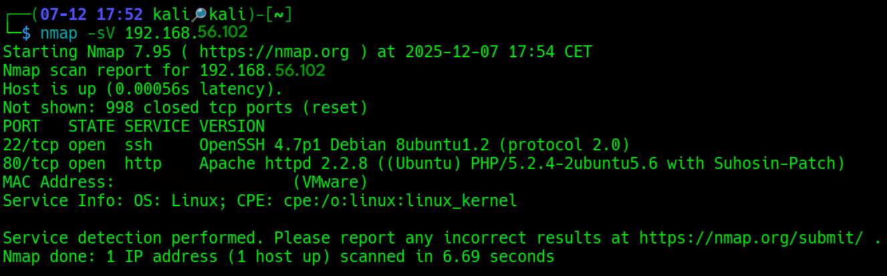

Ya tenemos localizada la máquina y podemos ver sus servicios. Tiene dos abiertos: SSH y HTTP en el acostumbrado puerto 80. Aquí observamos que corre Apache con PHP y Suhosin-Patch. 

Así que a partir de aquí lo mejor será ir directamente a este servicio, porque no tenemos absolutamente nada que nos permita entrar por SSH. 

## Explotación

- **HTTP**: puerto 80/tcp.
- **Servicio**: Apache httpd 2.2.8 (Ubuntu).
- **Hallazgos**: aplicación web con componentes desactualizados y vulnerables, incluyendo un CMS y módulos adicionales que exponen rutas de ataque encadenadas.
- Ruta de ataque:
1. 	Enumeración del servicio web en puerto 80.
2. 	Aprovechamiento de vulnerabilidad de LotusCMS.
3. 	Enumeración de Gallery → gconfig.php → pivote a PHPMyAdmin .
4. 	PHPMyAdmin → SSH → escalada de privilegios.

Enumeramos los directorios del servicio HTTP con **Gobuster**: 

		"gobuster dir -u http://[IP de la máquina vulnerable] -w /usr/share/wordlists/dirb/common.txt"
		

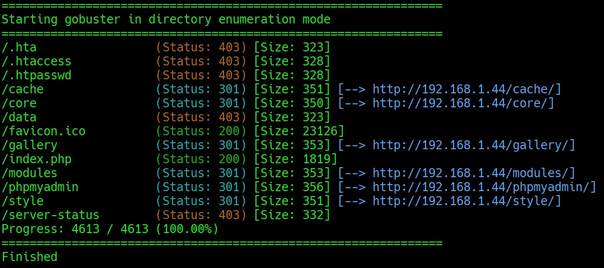

Y encontramos cosas interesantes: /cache, /core, /gallery/, /modules, /phpadmin y /style son directorios vulnerables. 

Podemos explorar los directorios, pero el que nos interesa es el de Gallery. Entramos en él:

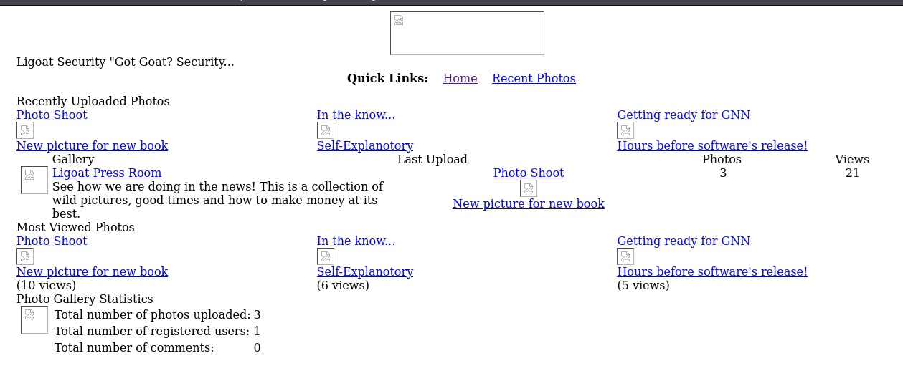

Encontramos esto. ¿Qué es lo que debemos hacer? Observar la url de la página en la que nos encontramos. Podemos probar cosas en la misma, como: "/albums.php?id=1" después de "/gallery", pero no nos va a arrojar nada. Así que paso a buscar y enumerar scripts dentro del servicio. Para ello, uso Gobuster otra vez, con este comando: 

				"gobuster dir -u http://[IP de la máquina vulnerable]/gallery/ -w /usr/share/wordlists/dirb/common.txt -x php
				"

Y vemos scripts interesantes:

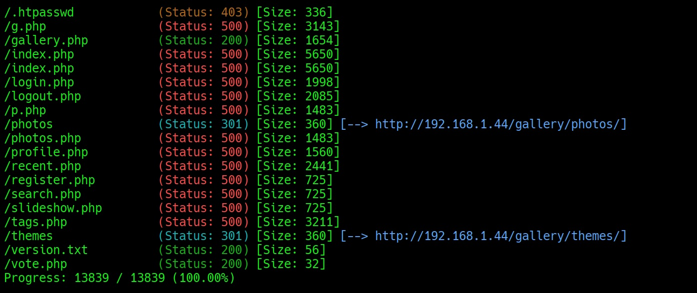

Gallery.php, search.php, tags.php, profile.php. Probamos los scripts. Algunos de ellos no van funcionar. Por ejemplo, podemos hacer: 

			"http://[IP de la maquina vulnerable]/gallery/gallery.php?search=test"

Y veremos un mensaje que nos dará información valiosa: 

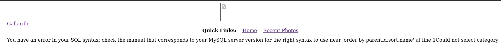

CMS está construyendo consultas SQL con los parámetros que le damos y nos revela que es vulnerable a inyección. Esto es importante. Sabiendo que hay consultas SQL que se construyen, podemos hacer uso de SQLmap para probar y ver si logramos obtener información. 

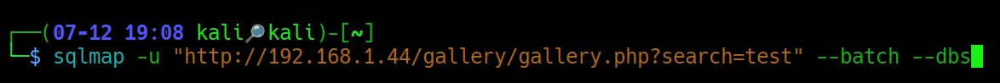

Y nos da esto:

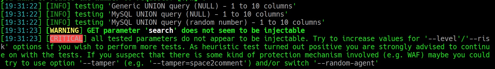

Con esta primera prueba con SQLmap no hemos logrado nada. Pero sigue siendo vulnerable. Aumentamos, por tanto, la agresividad con: 

			"sqlmap -u "http://[IP de la máquina vulnerable]/gallery/gallery.php?search=test" --level=5 --risk=3 --batch"

Tampoco conseguimos nada: 

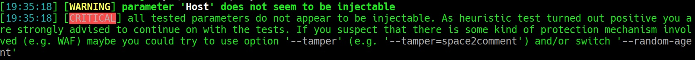

Hay protecciones activas que no nos permiten ir más allá. Así que habrá que probar otros parámetros, otras opciones. 

Probamos tamperscripts como "space2comment": 

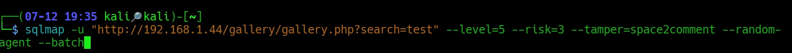

Y nos sale:

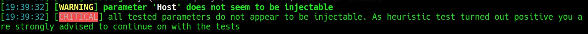

Tampoco hemos logrado nada, pero SQLmap nos anima a seguir probando en base al test heurístico. 

Podemos subir el nivel y la agresividad, pero nos va a seguir costando encontrar algo que nos sea de utilidad. 

Pero, en mi caso, no conseguí nada. Intenté usar los máximos niveles de "risk" y "level" y no conseguí nada. Usé otras herramientas, como "wfuzz" y tampoco encontré nada relevante o de interés. Así que tuve que cambiar el método de aproximarme a la máquina. Dejé las bases de datos y me centré en otro sitio.

En este caso, con una vulnerabilidad de Lotus, del panel de usuario principal de la máquina: 

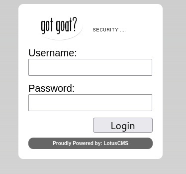

El exploit, fácilmente encontrable, nos pedirá, cuando lo ejecutemos, la IP de nuestra máquina atacante y el puerto que vamos a usar. Cuando lo hagamos, antes de darle a cualquier otra cosa, cogemos otra ventana de terminal y ponemos netcat escuchando en ese puerto.

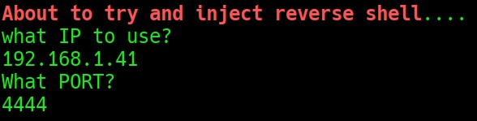

Así debería quedarnos en el exploit.
Cuando ya tenemos netcat, entonces, en la siguiente opción, de abrir una conexión inversa, le damos al 1:

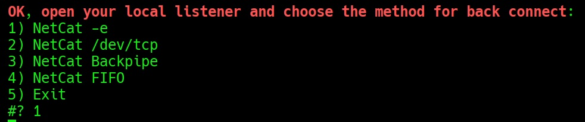

Entonces, se nos abrirá una conexión y podré escalar a partir de aquí:

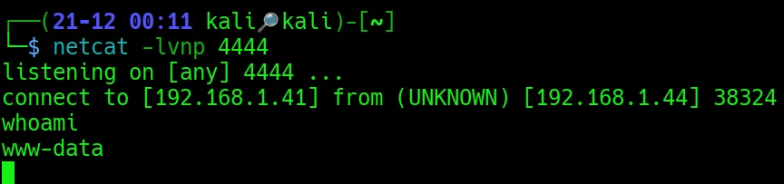

## Escalada de privilegios

Ya dentro, enumeramos lo que hay dentro y encontramos:

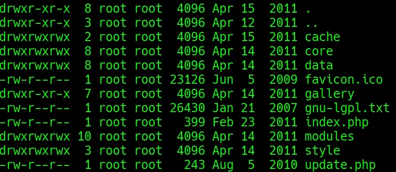

Aquí lo interesante lo encontraremos en gallery. Cuando lleguemos a gallery encontraremos:

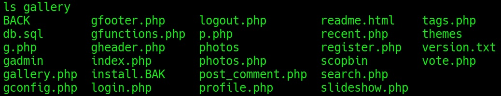

Si nos metemos en gconfig.php veremos unas credenciales con las que podemos pivotar. 

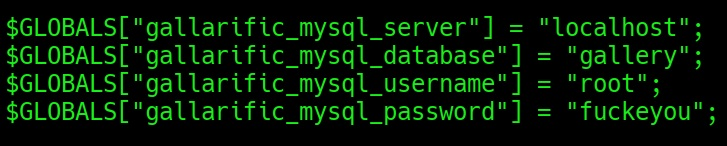

Con estas credenciales podemos meternos en MySQL. Haciendo: 

				"mysql -u root -p fuckeyou"

Desde ahí podemos ver las bases de datos y las tablas. Y encontramos en "gallarific_users" un usuario: "admin" con su contraseña en texto plano. Esta contraseña la intenté usar para pivotar al panel de PHPMyAdmin:

![[phpmyadmin 1.jpg]]

Como el usuario de la base de datos no me sirvió, usé la que había en gconfig.php (root:fuckeyou), y con esa sí pude entrar:

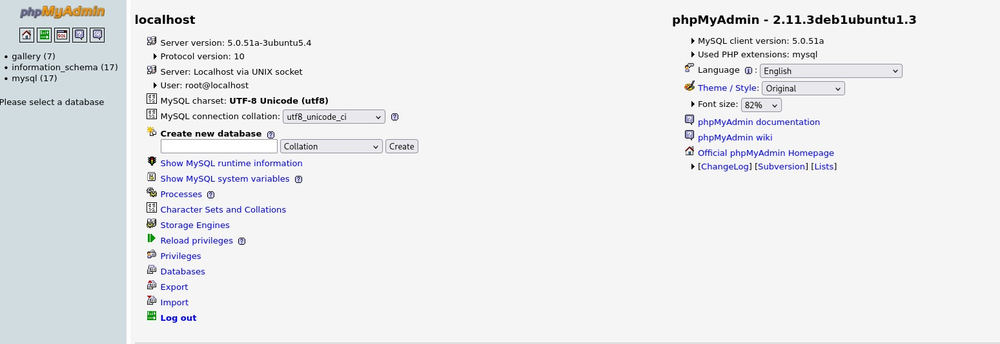

Aquí dentro nos vamos a "gallery" y dentro de "gallery" nos metemos en dev_accounts. Dentro encontraremos lo que buscamos:

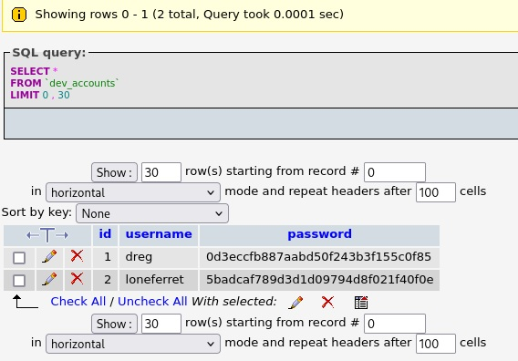

El nombre de usuario y los hashes de las contraseñas de dos cuentas: dreg y loneferret. Así que lo que hay que hacer ahora es exportarlas, traértelas a la máquina y crackearlas.

Al exportarlas nos dará un archivo: "dev_accounts.sql". No lo podemos usar directamente en John. Tenemos primero que filtrarlos y dejarlos limpios para que John los pueda entender y crackear. 

Una vez lo hemos hecho, se lo damos a John y nos los saca en unos segundos:

![[hashes crackeados 1.jpg]]

Con estas contraseñas podemos conectarnos por SSH. Para ello y como es un SSH tan antiguo como el propio sistema operativo de la máquina, necesitamos conectarnos de una manera particular. No vale con SSH directamente. Hay que escribir:

			"ssh -oKexAlgorithms=+diffie-hellman-group14-sha1 -oHostKeyAlgorithms=+ssh-rsa loneferret@[IP de la máquina Kioptrix]"

Así, nos pedirá que verifiquemos el fingerprint y luego que pongamos la contraseña. Cuando la puse, me salió directamente la terminal de lonefferret:

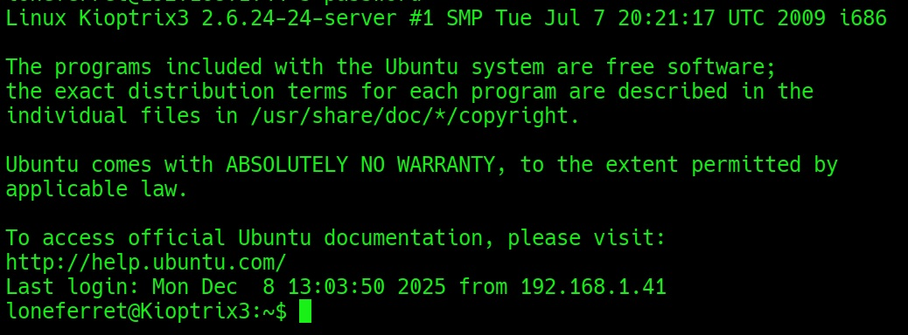

Dentro, sólo encontraremos dos archivos. Pero el que nos da la pista para continuar es el de CompanyPolicy.README. 

Lo leo y veo que pone: 

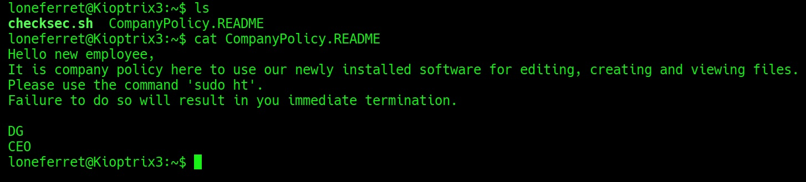

Intento usar el comando sudo ht, pero me da error:

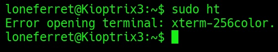

Para solucionar esto, escribo: 

					"export TERM=xterm"

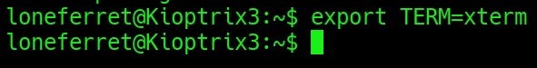

Después pongo:  sudo ht. Me sale una terminal de fondo azul con letras grises que no se ve bien. Manejarse por ella no es fácil, así que hay que saber moverse por ella.

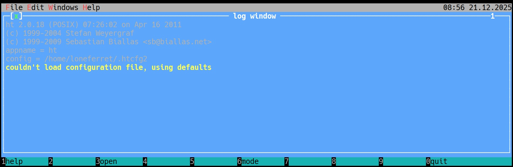

Le damos a ALT + F y bajamos hasta "Open". Le damos a esta opción. Escribimos: "/etc/sudoers". Sale esto:

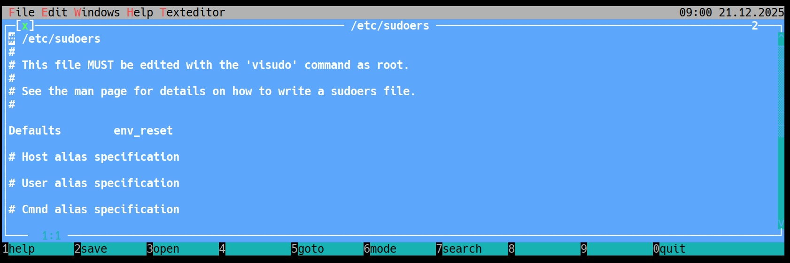

Nos fijamos en estas líneas:

				"# User privilege specification                  
				│root    ALL=(ALL) ALL                           
				│loneferret ALL=NOPASSWD: !/usr/bin/su, /usr/local/bin/ht "

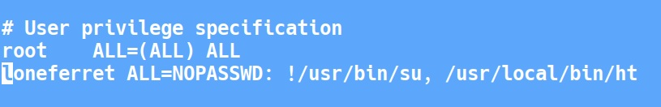

En loneferret añadí esta línea al lado de las demás: 

						"/bin/sh"

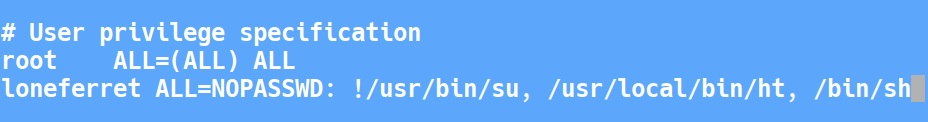

Le di a ALT + F, guardé y salí.

Y cuando hice sudo sh, conseguí escalar a root:

![[root conseguido 1.jpg]]

## Post-explotación

Al moverme a la carpeta /root me encontré con dos archivos:

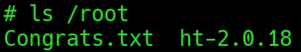

Me metí en el archivo de Congrats.txt y vi la felicitación de su creador:

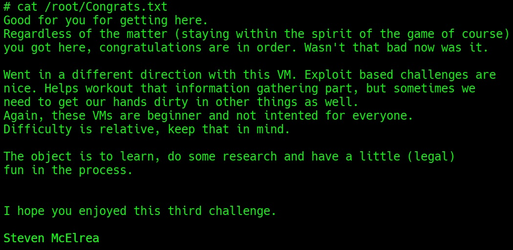

Así que con esto puedo considerar la máquina ya terminada. Para mí ha sido, probablemente, la más difícil de la serie Kioptrix, incluso que Kioptrix 5, que es lenta y diferente al resto de la propia serie. Pero está terminada.

El contenido de este trabajo es para fines educativos en entornos controlados. El autor no se hace cargo de posibles usos indebidos o maliciosos que puedan hacerse de la información que contiene. 
El propósito de estos ejercicios es aprender cómo funcionan las vulnerabilidades y mejorar las defensas de los sistemas. 
Estas son máquinas diseñadas específicamente para ser vulneradas y exploradas.
