Para realizar esta cuarta máquina de Kioptrix, tenemos que tener en cuenta las mismas cosas que en la anterior: probar el flujo habitual y típico del pentesting: reconocimiento y enumeración, explotación, escalada de privilegios y post-explotación. 

El objetivo de esta máquina es claro: conseguir acceso root. 

Advertencia: por motivos de privacidad, todas las IP han sido modificadas en las capturas. Las no relevantes están censuradas y las de las VM cambiadas por IP falsas. Vamos a asumir que mi VM atacante es: 192.168.56.101 y Kioptrix 2 (la máquina vulnerable): 192.168.56.102

## Reconocimiento y enumeración

Empezamos como siempre: usando **Netdiscover** o **Nmap** para mapear los dispositivos de nuestra red. En cuanto encontramos la IP de la máquina (en mi caso la asociada a VMWare), probamos con nmap a enumerar sus servicios y ver los puertos que hay abiertos. Encontramos esto: 

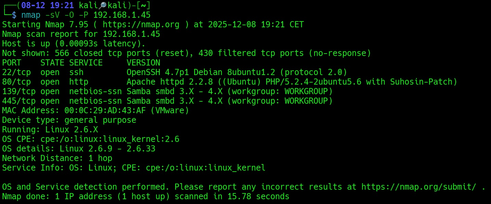

Con lo cual tenemos dos servicios interesantes: SSH en el 22, y HTTP en el 80. Además, también vemos que hay Samba abierto en 139 y 445, que nos pueden ser de utilidad para listar usuarios del sistema. 

Para empezar, antes de hacer nada, me pongo a enumerar y sacar la información que puedo de Samba, para ver qué usuarios puede haber en el sistema. Para ello usamos:

			"enum4linux -a [IP de la máquina Kioptrix]"
			

Y vemos los usuarios:

.jpg)

Y encuentro estos: nobody, robert, root, john y loneferret. 
Pero también encuentro:

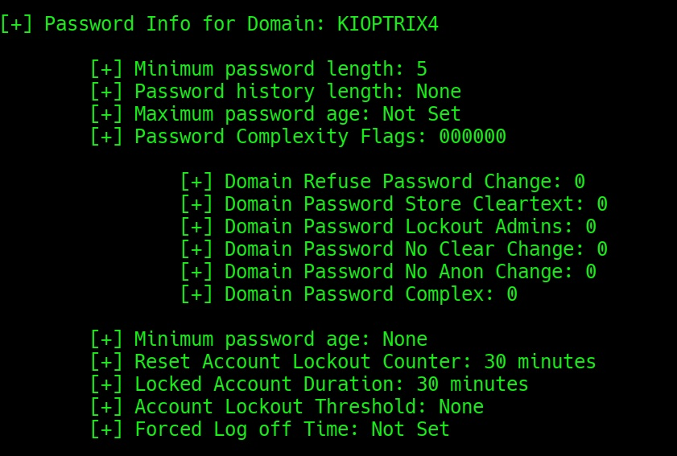

Con estos usuarios listado, ya puedo empezar a explorar otros servicios, como el HTTP del puerto 80. 

## Explotación

Cuando entramos en la IP de Kioptrix por el puerto 80 vemos: 

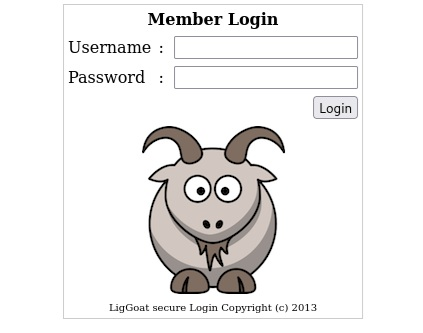

El cual tal vez, o seguramente, pueda explotarse de algún modo. 

Enumerados subdirectorios con Dirb y encontramos esto:

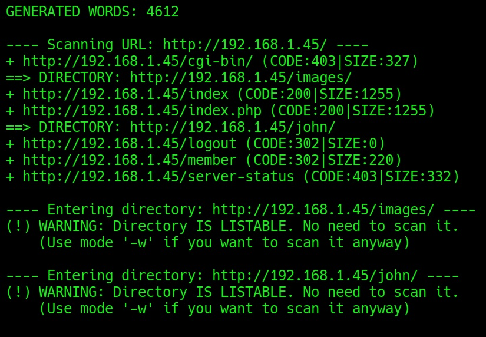

Hay un directorio que está relacionado con uno de los usuarios de Samba: John. Puede ser el sitio perfecto para ir adentrándonos en el sistema. 

Al meternos en el subdirectorio nos encontramos con esto:

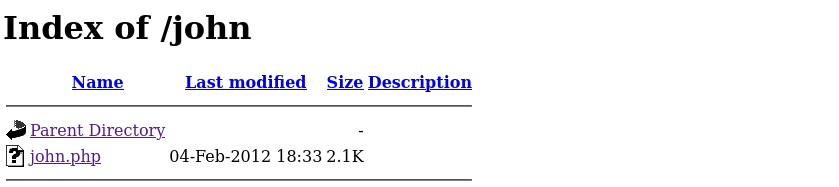

Si le damos a "john.php" nos redirige al mismo sitio de antes: el panel de login. Así que es aquí donde tenemos que centrarnos ahora. 

Tras probar inyecciones SQL básicas, decido pasar a **SQLmap** para automatizar los intentos y hacer inyecciones mucho más profundas y potentes. 

Con este comando de SQLmap probamos: 

				"sqlmap -r request1.txt --flush-session --level=5 --risk=3 --technique=T --tamper=space2comment --random-agent --batch
				"
				
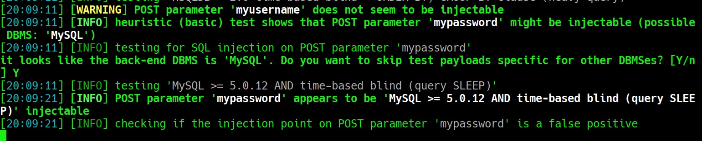

Encontramos que el parámetro "mypassword" es inyectable. Y luego:

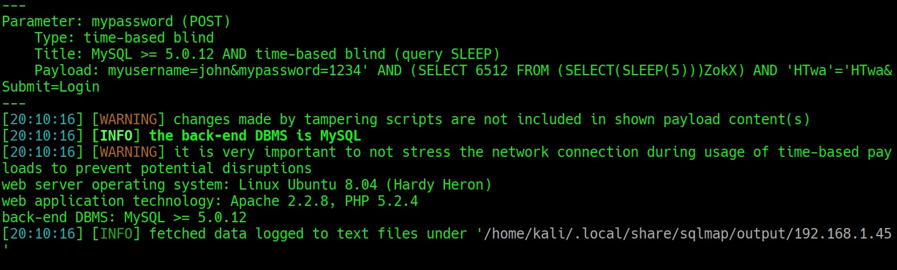

Ya lo tenemos inyectado. 
 Tenemos que listar ahora las bases de datos. Hacemos: 

			"sqlmap -r request1.txt -p mypassword --dbs"

Encontramos tres bases de datos: 

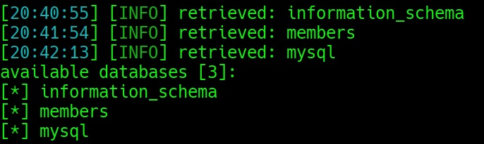

A continuación, listamos las tablas de esas bases de datos con:

			"sqlmap -r request1.txt -p mypassword -D kioptrix4 --tables"

Con esos parámetros no me sacó nada SQLmap. Con estos sí: 

			"sqlmap -r request1.txt -p mypassword --threads=5 --time-sec=10 --dump"

Le puse 5 hilos para acelerar el proceso y además le di más tiempo para operar. 

Y ya me sacó las tablas con sus datos:

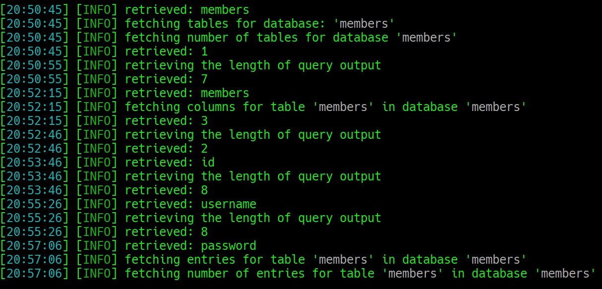

Después de un rato, tenemos dos usuarios con sus contraseñas:

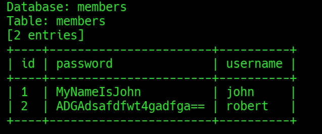

El usuario de john tiene su contraseña en texto plano. Robert, por el contrario, en formato extraño que parece Base64, pero no se puede descifrar. Así que tenemos que intentar pivotar con la contraseña de john. 

Vamos a probar con el servicio SSH.

## Escalada de privilegios

- **SSH** puerto 22/tcp 
- **Servicio**: OpenSSH 4.7p1 Debian 8ubuntu1.2 
- **Hallazgos**: acceso con credenciales del usuario John; shell restringida a pocos comandos. 
- **Impacto**: medio → punto de entrada que permite explotación y escalada de privilegios. 
- **Evidencia**: sesión SSH mostrando limitación de comandos. 

Y efectivamente, en SSH podemos entrar con John. 

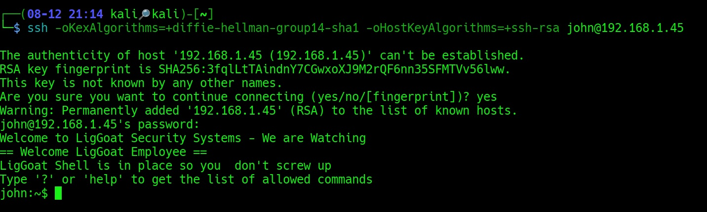

Si hacemos: 

					"echo os.system('/bin/bash')"

Salimos de la shell limitada para entrar en una shell más normal. Aunque el usuario john no tiene archivos.

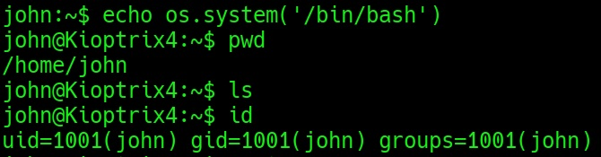

Exploramos variedad de archivos como los que hay en /var/www y encontramos diversos archivos. Podemos leer, por ejemplo, el de "database.sql". 

Hacemos:

				"cat /var/www/database.sql"

Y encontramos dentro que podemos acceder a MySQL como root sin credenciales. 

Dentro encontramos lo mismo que habíamos encontrado con SQLmap, pero podemos intentar pivotar al usuario robert aunque no tengamos la contraseña en texto plano. 

Y funciona: 

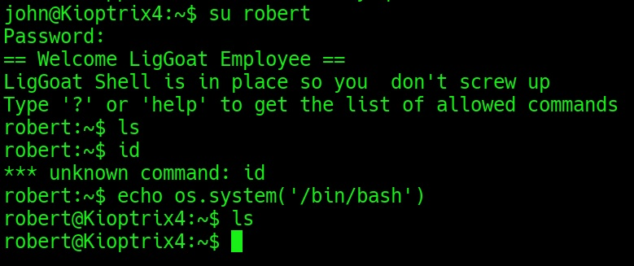

Aquí no podemos hacer mucho más que con john, salvo una cosa: descubrir un nuevo usuario, llamado loneferret.

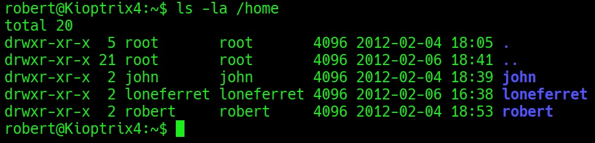

Listamos los archivos de loneferret y encontramos:

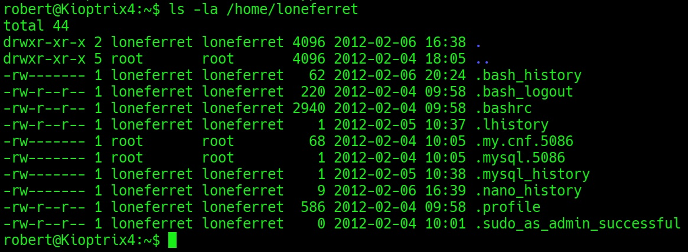

loneferret tiene permisos de sudo, así que necesitamos hacernos con este usuario. 

Si hacemos:

				"cat /etc/passwd | grep loneferret"

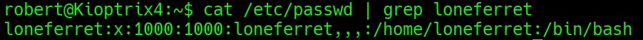

Confirmamos que loneferret es el administrador del sistema.

La única manera que he encontrado de poder conseguir la escalada final a root es aprovecharse de las UDF (User Defined Function) de MySQL, que son funciones que se pueden añadir a MySQL para extender sus capacidades, como hacer cálculos personalizados, manipular datos, etc. Se implementa a través de librerías compartidas (.so) que se cargan dinámicamente. 

Pues en Kioptrix 4 están habilitadas las UDF y son peligrosas porque, si corren como root, como es este caso, desde MySQL pueden ejecutarse UDF que a su vez ejecuten comandos del sistema (como sys_exec o sys_eval) con privilegios de root. 

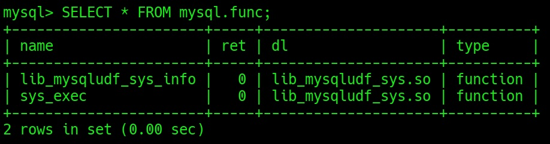

Aprovechando esto, podemos ejecutar comandos como root desde MySQL lo que implica que podemos coger y copiar el archivo con las contraseñas de los usuarios del sistema y pasárnosla a nuestro usuario de robert. 

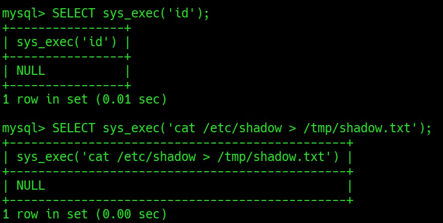

Aunque no se vea ninguna salida o respuesta afirmativa, los comandos funcionan. 

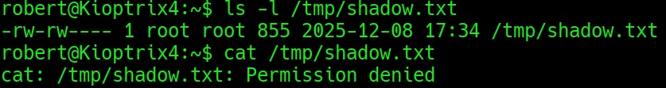

Como se puede comprobar, existe en nuestro directorio. Pero no nos deja leerlo. Tenemos que usar la misma vía para darnos permisos para leerlo. 

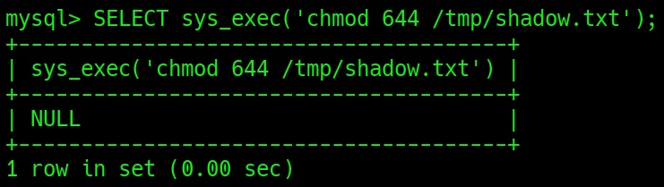

Y ya tenemos el hash del usuario administrador:

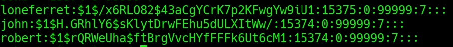

Sin embargo, no pude crackear el hash de loneferret, así que tenía que probar otra cosa. 

Aprovechando que a través de MySQL podía ejecutar acciones como root, lo que hice fue aprovechar el bit SUID para otorgarle privilegios de root al usuario robert. Así tendría ya total control y habría conseguido escalar los máximos privilegios. 

Para ello, volví a MySQL y lo añadí manualmente:

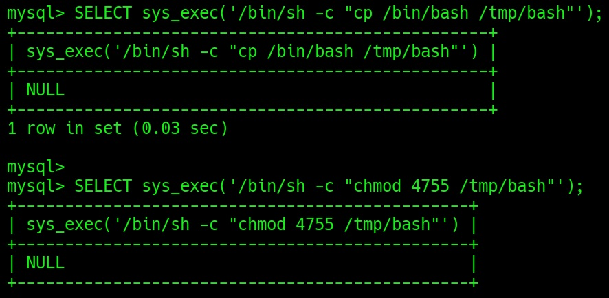

Luego ejecutamos y hacemos id y vemos el cambio que se realiza:

![[privilegios escalados 1.jpg]]

Con esto tenemos poderes de root y podemos hacer lo que queramos.

## Post-explotación

Ahora que tenemos poderes totales, podemos ir al directorio de root. Dentro de él encontraremos el mensaje que nos felicita por haber llegado a root y resuelto la máquina. 

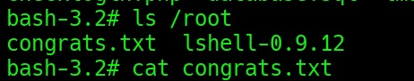

Si lo abrimos, el mensaje de felicitación nos dice:

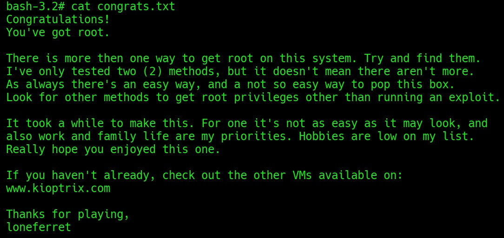

Así que, con esto la máquina está terminada, al menos de la manera en que he conseguido realizarla. 

## Vía alternativa: cambio de /etc/shadow para escalar a loneferret y de loneferret a root

Hay otra manera de completar la máquina que he probado y me ha costado varios intentos, porque no es fácil. 
Esta vía la he hecho desde robert. Para conseguirla, creamos un hash de una clave que determinamos nosotros con Openssl. Así:

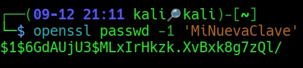
Con este hash fui a SSH, me conecté con robert, escapé de la shell limitada y aproveché los permisos root de MySQL para realizar el cambio de hashes y todas las acciones necesarias. 
Empecé con este comando: 

			"SELECT sys_exec('/bin/sh -c "cp /etc/shadow /tmp/shadow.edit && chmod 644 /tmp/shadow.edit"');"

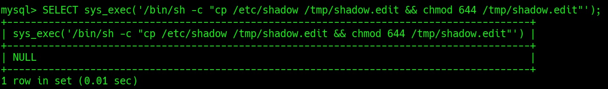

Pero no me funcionó. Luego intenté con este comando:

				"<sed -i \'s#^loneferret:[^:]*:#loneferret:$1$QOryrNRa$T6Dhh1PwLevDzDwUIEPOJ1:#\' /tmp/shadow.edit"');"

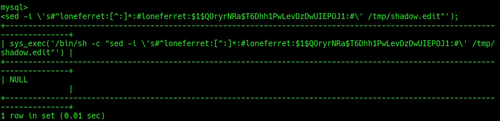

Luego este: 

			"SELECT sys_exec('/bin/sh -c "cp /tmp/shadow.edit /etc/shadow"');"

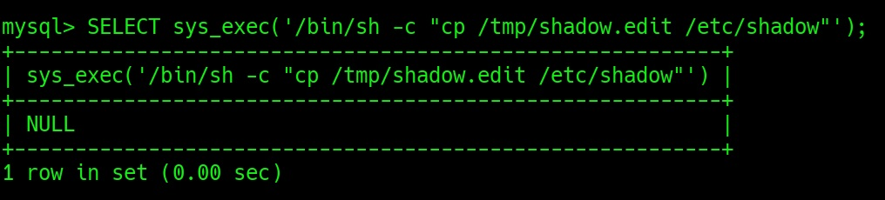

Pero como no me funcionó tampoco, probé esto:

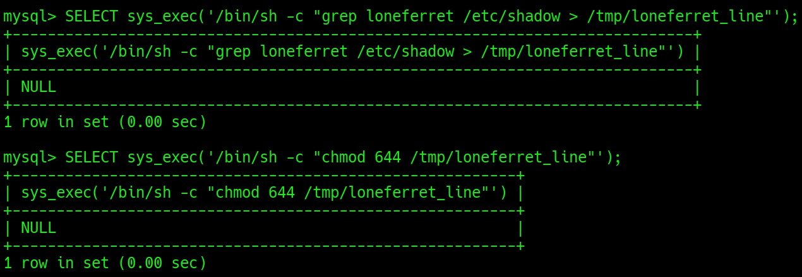

Los comandos son: 

				"SELECT sys_exec('/bin/sh -c "grep loneferret /etc/shadow > /tmp/loneferret_line"');" y "SELECT sys_exec('/bin/sh -c "chmod 644 /tmp/loneferret_line"');"

Y algo avancé, pero se quedó el hash vacío. Ahora el usuario no tenía ninguna contraseña. 

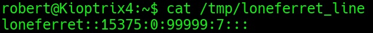

Así, sin embargo, no iba a poder entrar. Había que solucionarlo. Probé esto ahora: 

			"sys_exec('/bin/sh -c "sed -i \'s#^loneferret:[^:]*:#loneferret:$1$QOryrNRa$T6Dhh1PwLevDzDwUIEPOJ1:#\' /etc/shadow"') |"

Luego hice esto: 

			"sys_exec('/bin/sh -c "sed -i \'s#^loneferret:[^:]*:#loneferret:$1$c/r50pMh$L9ZCWM2fBIiWvJwCwUP6V0:#\' /tmp/shadow.edit"')"

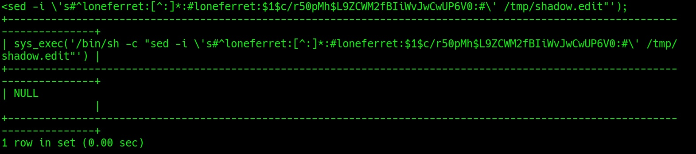

Extraje la línea a un archivo que pudiera leer desde robert, al que daba permisos: 

			"SELECT sys_exec('/bin/sh -c "chmod 644 /tmp/loneferret_line2"');"

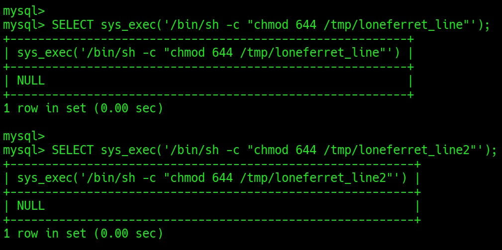

Lo intenté varias veces con varios archivos. 

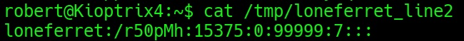

¿Qué pasó aquí? Algo se cambió dentro del archivo shadow. Pero el hash estaba incompleto. Con este hash a medias no podía iniciar sesión. ¿Cuál era el problema? ¿Qué estaba sucediendo? El problema estaba en el escapado de caracteres, que hacía que el hash se perdiera entre MySQL, Bash y shadow. 

Probé a hacer escapado de los caracteres a ver si funcionaba:

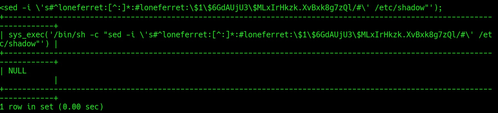

El comando era: 

			"sys_exec('/bin/sh -c "sed -i \'s#^loneferret:[^:]*:#loneferret:\$1\$6GdAUjU3\$MLxIrHkzk.XvBxk8g7zQl/#\' /etc/shadow"')"

Seguido de los mismos pasos de antes:

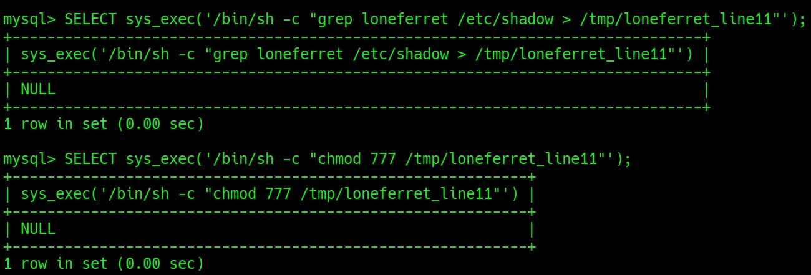

Y conseguí avanzar, pero seguía sin entrar el hash entero:

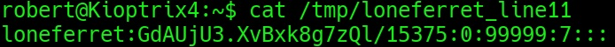

Probé, tras esto, con: 

			"sys_exec('/bin/sh -c "sed -i \'s|^loneferret:[^:]*:|loneferret:\\$1\\$6GdAUjU3\\$MLxIrHkzk.XvBxk8g7zQl/:|\' /etc/shadow"')"

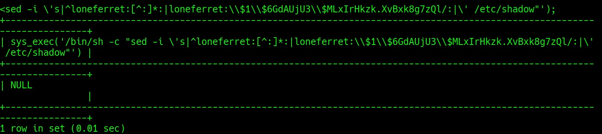

Después lo mismo, extraer la línea a un archivo y darme permisos después para leer el permiso. Y entonces vi el hash entero:

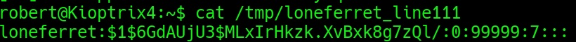

Y cuando probé con la contraseña que le había puesto, me daba error: 

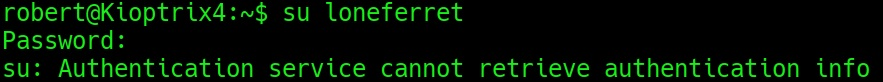

El error estaba en que el hash no seguía el mismo orden que el resto de shadow, por lo que no reconocía esa línea y no me dejaba autenticarme. 

Tuve que volver a MySQL y arreglar el hash y su estructura:

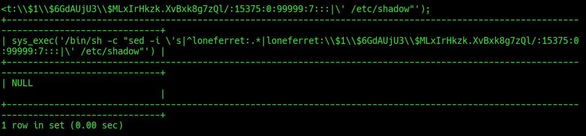

El comando: 

			"sys_exec('/bin/sh -c "sed -i \'s|^loneferret:.*|loneferret:\\$1\\$6GdAUjU3\\$MLxIrHkzk.XvBxk8g7zQl/:15375:0:99999:7:::|\' /etc/shadow"')"

Inicié sesión con la contraseña que había creado antes (probé dos veces con dos contraseñas distintas) y me metí dentro del usuario administrador:

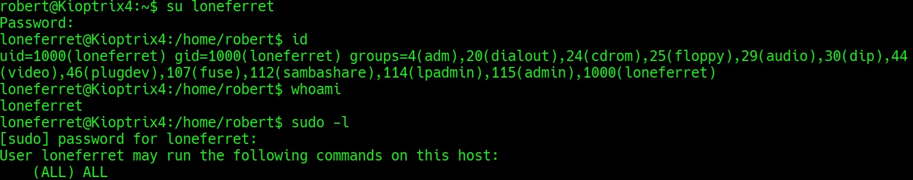

Y tenía todos los permisos. Podía usar sudo. Para subir a root ahora era facilísimo: 

						"sudo su"

Y ya era root del sistema:

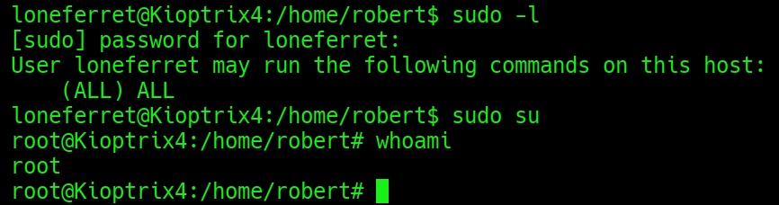

Desde este punto, se puede hacer lo mismo que antes y leer también el mensaje. Así la máquina está terminada de dos formas distintas. Seguramente, como dice el mensaje en root, debe haber más, pero yo lo he conseguido de estos dos modos. 

## En resumen:

Vía 1: **Bit SUID** 
- Localizar binario con bit SUID activado. 
- Ejecutar el binario para obtener shell con privilegios de root. 
- Resultado: acceso directo a root sin credenciales adicionales. 

Vía 2: **Cambio de contraseña de loneferret vía MySQL**
- Acceso inicial a MySQL como root. 
- Generar hash con: openssl passwd -1 'MiNuevaClave'
- Insertar hash en /etc/shadow para loneferret (escapando caracteres).
- Iniciar sesión como loneferret con la nueva contraseña. 
- Verificar permisos sudo: (ALL) ALL. 
- Escalar a root con: sudo su 

Como conclusión puedo decir que la máquina puede completarse sin usar exploits ni scripts. Con SQLmap y aprovechando las malas configuraciones que tienen los diversos servicios es posible escalar los privilegios hasta llegar a root. 

El contenido de este trabajo es para fines educativos en entornos controlados. El autor no se hace cargo de posibles usos indebidos o maliciosos que puedan hacerse de la información que contiene. 
El propósito de estos ejercicios es aprender cómo funcionan las vulnerabilidades y mejorar las defensas de los sistemas. 
Estas son máquinas diseñadas específicamente para ser vulneradas y exploradas.
